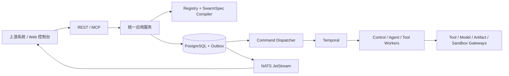

# SwarmCore

面向企业智能体应用的受控、多租户、耐久执行内核。

SwarmCore 接收已经明确的目标与执行策略，负责校验、编译、调度、状态管理、可靠性、
安全治理、审计和结果交付。它不替上游调用方理解业务目标，也不把 Agent SDK 当作工作流
状态源。

> 项目当前处于 v1 候选基线建设阶段，尚未完成生产资格验证。准确的实现状态与开放门禁
> 以 [开发计划](docs/swarmcore-development-plan.md) 为准。

## 核心能力

- **耐久编排**：将 SwarmSpec 编译为不可变 ExecutionPlan，由 Temporal 执行状态机、
  重试、并发、暂停、恢复、取消和人工审批。
- **统一入口**：REST API、MCP 和 Web 控制台复用同一套应用服务、权限、幂等与审计逻辑。
- **受控能力调用**：Agent、Tool、Model、Artifact 和 Sandbox 通过 Adapter 或 Gateway
  接入，统一执行策略、预算、Secret、租户边界和可观测性检查。
- **可靠状态交付**：PostgreSQL 保存产品事实，Outbox 保证命令与事件可靠投递，NATS
  JetStream 负责事件分发。
- **业务能力扩展**：通过不可变 Capability Pack 组合策略、Agent、Tool、规则、证据和
  报告，而不是为每种业务 Agent 复制一套运行时。
- **业务工作台**：提供 Business Works、文档处理、Case、Assessment、Finding、Report
  和 DecisionAsset 等统一产品入口。

当前仓库包含合同完整性、合同七维后评价、偏差分析、发票一致性校验和招采一致性与
供应商风控等能力包。它们的
验收层级不同；请勿将本地实现状态等同于生产可用。

## 架构概览



关键约束：

1. Temporal 是唯一耐久执行引擎；Workflow 保持确定性，网络、数据库、模型和文件 I/O
   只能进入 Activity、Tool 或 Adapter。
2. PostgreSQL 是产品状态、权限、审计和查询的事实源；NATS 不保存最终业务状态。
3. `packages/domain` 不依赖 FastAPI、数据库、Temporal 或具体 Agent SDK。
4. 多租户访问始终保留 tenant/project 边界，不绕过幂等、状态机、Outbox 和审计机制。
5. Agent SDK 通过 Adapter 接入；当前默认生产路径为 Agno Adapter。

完整设计见 [SwarmCore 系统设计](docs/swarmcore-system-design.md)。

## 技术栈

| 领域 | 技术 |
|---|---|
| API 与应用 | Python 3.12、FastAPI、Pydantic v2、uv |
| 编排与 Agent | Temporal Python SDK、Agno Adapter |
| 数据与事件 | PostgreSQL 17、SQLAlchemy 2、Alembic、NATS JetStream |
| 治理与存储 | OPA、Vault、S3 API、Artifact Gateway、Sandbox Manager |
| 可观测性 | OpenTelemetry、Phoenix |
| Web | React 19、TypeScript、Vite、TanStack Query、Zustand |
| 质量 | Ruff、mypy strict、pytest、Vitest、Playwright |

## 仓库结构

```text
apps/                   可独立运行的 API、Worker、Gateway 和 Web 应用
packages/               领域、应用服务、编译器、持久化、运行时与能力包
tests/unit/              快速、隔离的单元测试
tests/integration/       PostgreSQL、Temporal 等集成测试
deployments/compose/     本地基础设施
docs/                    系统设计、开发计划和专题设计
scripts/                 集成测试与系统评测脚本
```

`agno/` 和 `agent-ui/` 是上游参考代码，不属于 SwarmCore workspace，请勿修改。

## 本地快速开始

### 1. 环境要求

- Python 3.12
- [uv](https://docs.astral.sh/uv/)
- Node.js 与 pnpm 10.26
- Docker Compose

### 2. 安装依赖与配置

```powershell
uv sync --all-packages
pnpm install
Copy-Item .env.example .env
```

`.env.example` 中的凭据仅用于本地开发。不要提交 `.env`，并在任何共享环境替换所有
`replace-with-at-least-32-random-bytes` 占位值。

如需无需模型凭据的确定性本地链路，将 `.env` 中的配置改为：

```dotenv
SWARMCORE_USE_FAKE_AGENT=true
```

### 3. 启动基础设施与初始化数据库

```powershell
docker compose -f deployments/compose/compose.yaml up -d
uv run alembic -c packages/persistence/alembic.ini upgrade head
uv run swarmcore-seed
```

本地 Compose 暴露 PostgreSQL `5433`、Temporal `7233`、Temporal UI `8088`、NATS
`4222`、OPA `8181`、Vault `8200`、Phoenix `6006` 和 OTLP `4317`。更多说明见
[本地基础设施文档](deployments/compose/README.md)。

### 4. 启动运行进程

在独立终端中按需启动以下进程：

```powershell
uv run swarmcore-api
uv run swarmcore-command-dispatcher
uv run swarmcore-worker-control
uv run swarmcore-worker-agent
uv run swarmcore-worker-tool
uv run swarmcore-tool-gateway-api
uv run swarmcore-artifact-gateway
uv run swarmcore-model-gateway
uv run swarmcore-event-publisher
uv run swarmcore-projection-reconciler
```

Webhook Worker 和 Sandbox Manager 是按场景启用的附加进程：

```powershell
uv run swarmcore-worker-webhook
uv run swarmcore-sandbox-manager
```

多副本部署时可通过 `SWARMCORE_WORKER_MAX_CONCURRENT_*` 和
`SWARMCORE_NATS_STREAM_REPLICAS` 设置每副本容量与 JetStream 副本数。生产 Control
Worker 必须配置 `SWARMCORE_ARTIFACT_STORE=s3` 及
`SWARMCORE_ARTIFACT_S3_BUCKET`；本地 Artifact Root 不支持跨 Pod 共享。

最后启动 Web 控制台：

```powershell
pnpm web:dev
```

默认入口：

| 服务 | 地址 |
|---|---|
| Web 控制台 | <http://localhost:5173> |
| REST API / OpenAPI | <http://localhost:8000/docs> |
| MCP | <http://localhost:8000/mcp> |
| Temporal UI | <http://localhost:8088> |
| Phoenix | <http://localhost:6006> |

只想体验无需后端和凭据的公开数据引导演示时，单独运行 `pnpm web:dev`，然后访问
`/business-works/report-generation`，选择“体验公开数据 Demo”。演示结果用于验证交互
流程，不构成对真实合同的正式结论。

## API 与产品入口

核心 MCP 工具包括：

- `swarm.capabilities.get`
- `swarm.strategy.validate`
- `swarm.strategy.compile`
- `swarm.run.create`
- `swarm.run.status`
- `swarm.run.result`
- `swarm.run.control`
- `contract_performance_initialize`
- `contract_performance_collect`
- `contract_performance_get_plan`
- `contract_performance_get_snapshot`
- `supplier_risk_monitor_create`
- `supplier_risk_monitor_refresh`
- `supplier_risk_history_list`
- `supplier_risk_alerts_list`
- `supplier_risk_work_orders_list`
- `supplier_risk_work_order_create`
- `supplier_risk_work_order_update`
- `run_swarm_calibration`
- `structure_document`
- `get_document_processing`
- `get_structured_package`
- `confirm_document_fields`

REST 与 MCP 都调用统一应用服务。产品侧优先使用 Business Work、Case、Assessment 和
DecisionAsset 术语；`WorkItem`、`Evaluation` 与 `RuleSet` 仅作为兼容存储/API 术语保留。
合同履约专用 REST 位于
`/v1/projects/{projectId}/contract-performance/cases`，覆盖 Case 创建、计划初始化/发布、
增量采集、甘特、证据账和不可变结果快照。
招采一致性与供应商风控 REST 位于
`/v1/projects/{projectId}/procurement-supplier-risk`，覆盖监控刷新、不可变历史、预警和
风控工单。默认公共源实时查询中国政府采购网严重违法失信记录；其他授权 Provider 通过
HTTPS allowlist 和 Vault `secretRef` 接入。详细设计见
[招采一致性与供应商风控设计](docs/swarmcore-procurement-supplier-risk-design.md)。
智能体调度校准专用 REST 为
`POST /v1/projects/{projectId}/swarm-calibration:run`，输入真实 GitHub Issue、校准目标、
验收标准和可选沙箱命令，返回统一 Assessment 快照。详细设计见
[智能体调度校准业务设计](docs/swarmcore-swarm-calibration-design.md)。
文件结构化 REST 复用业务资料库的上传、不可变版本、处理进度和人工确认接口，并增加
有序处理事件、结构化资料包、发布、重处理和取消处理接口；MCP 直接复用同一应用服务。
支持 ODT/ODS/ODP、PDF、DOCX/XLSX/PPTX、文本、表格和图像输入，大文件由 Temporal
按页组或工作表耐久处理。实现与验收边界见
[文件结构化智能体设计](docs/swarmcore-document-structuring-design.md)。

可重复准备公开真实样例并核验哈希、ODF 结构、68 页分组和无文本层 OCR 路由：

```powershell
uv run python scripts/prepare_document_structuring_demo.py `
  --output .tmp/document-structuring-demo
```

Web 控制台的主要入口：

- `/business-works/:workKey`：各业务工作的详情、配置与办理入口；`/business-works` 重定向到工作台
- `/strategies`：策略管理
- `/runs`：运行记录与状态
- `/agents`、`/tools`、`/models`：统一能力中心
- `/documents`：业务文档库
- `/actions`：人工复核与操作中心

## 配置与安全

配置项及本地默认值见 [.env.example](.env.example)。常用配置分组：

- 基础设施：`SWARMCORE_DATABASE_URL`、`SWARMCORE_TEMPORAL_ADDRESS`、
  `SWARMCORE_NATS_URL`
- 模型：`SWARMCORE_MODEL_ROUTES`、`SWARMCORE_MODEL_PROVIDER_URL`、
  `SWARMCORE_MODEL_PROVIDER_API_KEY`
- Gateway：`SWARMCORE_TOOL_GATEWAY_URL`、`SWARMCORE_ARTIFACT_GATEWAY_URL`、
  `SWARMCORE_MODEL_GATEWAY_URL`
- 文档处理：`SWARMCORE_OCR_ENDPOINT`、`SWARMCORE_TESSERACT_CMD`
- 调度校准：`SWARMCORE_GITHUB_TOKEN`、`SWARMCORE_GITHUB_API_URL`、
  `SWARMCORE_CALIBRATION_SANDBOX_ENABLED`、`SWARMCORE_CALIBRATION_SANDBOX_IMAGE`
- 供应商风控：`SWARMCORE_SUPPLIER_RISK_ALLOWED_HOSTS`、
  `SWARMCORE_SUPPLIER_RISK_TIMEOUT_SECONDS`；商业 Provider 凭据使用 Vault `secretRef`
- 受控文件系统：`SWARMCORE_FILESYSTEM_TOOLS_ENABLED`、
  `SWARMCORE_FILESYSTEM_EXECUTOR_MODE`、`SWARMCORE_FILESYSTEM_ROOT`

仓库验证镜像必须由 `apps/repository-verifier` 构建，构建基础镜像和运行镜像都必须使用
组织批准的 immutable digest；未配置时结果为 `UNVERIFIED`，质量门禁不会自动通过。

生产部署必须使用 JWT、OPA、Vault 工作负载认证和内部 mTLS，并关闭本地 Secret、直连
Provider、dry-run Sandbox 及本地文件系统执行模式。不完整的生产安全配置会在启动时
失败。具体约束以[系统设计](docs/swarmcore-system-design.md#8-安全治理与可观测)为准。

## 开发与验证

后端：

```powershell
uv run ruff check .
uv run mypy
uv run pytest -q tests/unit
```

前端：

```powershell
pnpm web:lint
pnpm web:test
pnpm web:build
pnpm web:e2e
```

隔离的 PostgreSQL 与 Temporal 集成测试：

```powershell
./scripts/test-integration.ps1
```

Linux/CI：

```bash
bash scripts/test-integration.sh
```

测试脚本使用独立端口和数据卷，执行迁移及集成测试后自动清理。涉及 RLS 的单独测试也可
通过 `SWARMCORE_TEST_DATABASE_URL` 指向已经迁移的测试数据库。

## 项目状态与文档

- [系统设计](docs/swarmcore-system-design.md)：产品边界与架构决策的事实来源
- [开发计划](docs/swarmcore-development-plan.md)：里程碑、开放门禁、实现状态与验收证据
- [本地基础设施](deployments/compose/README.md)：Compose 服务和集成测试说明

当前主里程碑为 M5，目标是形成可从干净检出复现的 v1 候选基线；M6 及之后的生产同构、
故障恢复、容量与发布资格仍待完成。只有通过对应测试和门禁的能力才应标记为
`VERIFIED`。
