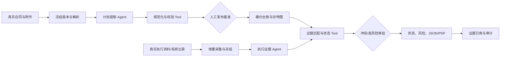

# 智能体业务开发功能设计文档

状态：VERIFIED / LOCAL / PUBLIC-REAL-DATA（公开真实数据链已验收；未完成授权企业真实资料资格验收）  
目标业务：`contract-performance`  
建议能力包：`capability://contract-performance@1.0.17`  
建议策略：`strategy://contract-performance/initialize@13`、`strategy://contract-performance/collect@10`  
资料核验日期：2026-07-28

## 1. 需求概述

### 1.1 业务目标

把合同从“静态文件”转为可执行、可采集、可追溯的履约计划：

1. 从合同、附件、技术规格和已批准变更中提取工期、交付、付款、服务标准、验收要求、义务和里程碑。
2. 生成带依赖、计划日期、责任方、付款门槛和证据要求的履约台账与甘特图。
3. 从业务资料库和授权系统持续采集验收单、发货单、到货单、付款凭证、会议纪要、进度报告和服务记录。
4. 将执行证据与具体义务、交付项和里程碑关联，确定性计算完成、逾期、待证、冲突和付款条件状态。
5. 对歧义、证据冲突、关键延期、未批准变更和付款前置条件不足发起人工复核。
6. 输出可在线查看和下载的计划、执行状态、证据链、变更历史、风险清单及 JSON/PDF 报告。

本能力复用 SwarmCore 的 BusinessObject/Case、业务资料库、Assessment/Run、Temporal、
Model Gateway、Tool Gateway、Approval、Finding、Artifact、Outbox 和 Audit。REST 与 MCP
复用同一应用服务，不建立第二套业务逻辑。

### 1.2 目标用户

- 合同/采购经办人：建立合同履约计划，确认条款和变更。
- 项目经理/交付经理：查看甘特图、里程碑、证据缺口和延期。
- 仓储/使用部门：提供发货、到货、安装、验收和质量证据。
- 财务人员：核对付款条件、付款凭证和累计金额。
- 供应商协同人员：提交被授权的交付和整改资料，不能确认采购方验收。
- 内控/审计人员：重放任一状态和结论的来源、规则和人工决定。
- 项目管理员：配置资料源、规则、模型路由、角色和运行预算。

### 1.3 输入

- 主合同、订单、框架协议、SOW、技术规格、报价清单、服务级别协议和验收附件。
- 补充协议、变更单、签证、延期批准、索赔处理和变更审批记录。
- 计划数据：合同工期、交付清单、WBS、里程碑、依赖、项目日历、付款计划。
- 执行资料：发货单、物流/签收记录、到货单、安装调试记录、验收单、检测报告。
- 服务资料：工单、SLA 报表、月报、会议纪要、培训记录、整改与复验记录。
- 财务资料：发票登记、付款申请、付款凭证、质保金、扣款和累计付款台账。
- 运行参数：`asOf`、时区、币种、日历、逾期阈值、资料选择和人工审批规则。

### 1.4 输出

- `ContractPerformancePlan`：义务、交付项、里程碑、验收标准、服务指标、付款条件和责任方。
- `GanttSnapshot`：原始基准、当前批准基准、实际/预测日期、依赖及证据状态。
- `ExecutionEvidenceLedger`：执行资料、来源记录、关联对象、证据定位、冲突和人工确认。
- `ChangeHistory`：变更前后值、影响对象、批准状态、生效日、批准人及证据。
- `PerformanceSnapshot`：`ON_TRACK`、`AT_RISK`、`OVERDUE`、`EVIDENCE_PENDING`、
  `REVIEW_REQUIRED` 或 `COMPLETED`。
- 证据缺口、逾期、服务不达标、未批准变更、付款门禁和建议动作。
- 页面、结构化 JSON 和中文 PDF；三者使用同一冻结结果。
- Run 节点、模型/Tool 调用摘要、输入输出哈希、人工决定和审计事件。

### 1.5 成功定义

使用同一真实合同及其真实执行资料完成“真实输入 → 获取真实数据 → 智能体处理 → Tool 执行 →
业务结果 → 过程与依据展示”。系统至少应：

1. 实际读取一份真实合同和五类真实执行资料。
2. 提取并由人确认至少 10 项义务、3 个里程碑、1 组付款条件和 1 组验收/SLA 要求。
3. 实际调用资料读取、解析/OCR、证据检索、计划规范化、甘特计算、执行匹配、状态计算和报告 Tool。
4. 展示至少一个已完成里程碑、一个待证或逾期项、一个变更及其前后影响。
5. 任一结果能定位到不可变文件版本、页码/单元格/记录 ID、内容哈希和来源系统时间。
6. 证据不足时明确输出 `UNKNOWN/REVIEW_REQUIRED`，不由模型补造完成事实。

## 2. 自主决策与关键假设

| 决策/假设 | 依据 | 影响 | 验证方式 |
|---|---|---|---|
| 主场景按中国大陆企业货物与服务采购合同设计 | 需求术语为合同履约、到货、验收和付款凭证；这些类型能覆盖最小闭环 | 默认币种 CNY、时区 `Asia/Shanghai`，保留国际化字段 | 用一份货物或软件实施合同验证；工程计量为后续扩展 |
| Demo 只处理单合同、单项目 | 先证明计划和执行证据闭环，避免组合合同和供应链层级扩大范围 | 一个 Case 只有一个 `PRIMARY` 合同，可有供应商、订单等 `RELATED` Subject | 组合合同返回明确不支持提示 |
| 计划基准必须人工发布 | 合同条款可能互相引用、存在歧义，错误基准会污染后续全部判断 | Agent 生成候选计划，合同负责人确认后才成为 `PUBLISHED` 基准 | 未审批计划不能启动自动采集 |
| 只把“已批准变更”纳入当前基准 | 未批准会议意见或供应商主张不具有同等基准效力 | 未批准变更单列为风险，不覆盖原计划 | 以批准状态、生效日和审批证据测试 |
| 付款、验收和违约结论由规则与人控制 | 属于高风险业务决定，不应由模型直接决定 | 模型只提取和候选匹配；最终状态由确定性 Tool 和授权人员形成 | 断言 Agent 无付款/验收写权限 |
| 公开样例选择英国教育部已签 Skills Bootcamps 合同 | 该合同公开、真实、已签，包含服务期、付款里程碑、绩效指标、证据要求和变更机制 | 用于可重复的合同计划抽取和真实付款候选匹配，不作为中国法规验收样本 | 运行时记录下载 URL、时间、ETag 和 SHA-256 |
| 公开 DfE 支出只能作为付款候选证据 | 已核实 2024 年 4 月和 9 月 CSV 存在 `Cogrammar Ltd`、Skills Bootcamps 支出，但交易参考号不能直接对应公开合同编号 | 公开 Case 正确结果应为候选关联加 `REVIEW_REQUIRED`，不得声称该合同已付款 | 检查报告展示不匹配的合同/交易参考号 |
| 企业闭环必须使用同一合同下的授权真实资料 | 公开资料通常不披露合同专属验收单、签收单和付款凭证 | 最终业务验收必须由数据所有者提供真实资料或只读连接 | 验收记录 `sourceSystem/sourceRecordId/asOf/contentHash/authorizedBy` |
| 甘特图不等于关键路径分析 | 合同常只有日期而没有完整依赖、工期和日历 | 数据不足仍生成里程碑甘特，但 `criticalPath=null` 并标记原因 | 缺依赖时不得输出虚构关键路径 |
| 政府采购资料默认至少保留 15 年仅作为可选策略 | 《政府采购法》第四十二条适用于政府采购文件；一般商业合同应按企业档案政策 | 保留策略按项目/合同类型配置，不能一刀切 | 政府采购模板验证 15 年策略；普通合同使用企业策略 |

## 3. Demo 范围

### 3.1 范围内

1. 一个 tenant、一个 project、一个合同 Case；最多 200 份文件、500 个义务/交付项、200 个里程碑。
2. PDF、DOCX、XLSX、CSV、JSON、TXT、邮件导出及 JPEG/PNG 扫描件。
3. 一次“初始化计划”和多次“增量采集”，支持手工发起和每日定时触发。
4. 合同期限、义务、交付、服务指标、验收、付款、里程碑、依赖和变更抽取。
5. 里程碑甘特、计划/实际对比、证据缺口、状态与变更历史。
6. 上传、业务资料库、只读 API 和责任人签名导出四种真实数据接入方式。
7. 低置信、冲突、延期、未批准变更和付款门禁的人工审批。
8. 页面、JSON、PDF、Finding、Audit 和 Outbox 留痕。

### 3.2 资料上限与处理约束

- 单文件默认不超过 100 MB；超限文件先分卷或使用源系统结构化导出。
- 证据检索扫描全部冻结版本，每个业务域默认只向 Agent 注入 Top 8 片段。
- 合同正文和附件的总模型输入超过预算时按“主体条款、计划、质量验收、财务变更”分域处理。
- 扫描件必须经过 OCR 和质量检查；低质量关键页进入人工确认。
- 同一逻辑基准存在多个版本时不自动选择“最新”，必须由用户确认。

### 3.3 Demo 边界

- 不自动签署验收单、不确认法律违约、不发起付款、不修改 ERP/WMS/项目管理系统。
- 不替代工程监理、质量检测、法务、财务和合同负责人的专业判断。
- 不做供应商门户、电子签章、物流轨迹平台或项目计划软件的完整替代。
- 不支持多合同组合履约、总分包穿透、索赔金额裁定和复杂工程计量。
- 公开数据链用于可重复技术验收；业务通过结论必须来自同一合同的授权真实资料。

## 4. 业务角色

| 角色 | 职责 | 最小权限 | 目标 |
|---|---|---|---|
| 合同经办人 | 创建 Case、绑定资料、确认计划与变更 | `case.create/read`、`plan.review/publish` | 得到可信执行基准 |
| 项目/交付经理 | 查看和更新进度证据、处理延期 | `evidence.submit`、`milestone.review` | 及时发现待证与逾期 |
| 仓储/使用部门 | 提交到货、安装、验收证据 | `evidence.submit`、`acceptance.propose` | 证明交付和质量事实 |
| 财务复核人 | 确认付款记录和付款条件 | `payment-evidence.review` | 防止无验收或超条件付款 |
| 供应商协同用户 | 仅提交被分配资料 | `supplier-evidence.submit` | 提供真实交付资料，不能确认采购方结论 |
| 合同审批人 | 批准基准、变更和业务例外 | `approval.respond`、`change.approve` | 对高影响决定负责 |
| 内控/审计员 | 只读查看证据、版本和审计 | `contract-performance.audit` | 重现任一结果 |
| 项目管理员 | 配置连接、规则、模型、保留策略 | `configuration.manage` | 保证能力就绪，不审批自己的业务 Case |
| 系统服务身份 | 读取绑定数据、计算和写内部结果 | 短期 Capability Token | tenant/project 隔离和最小权限 |

## 5. 最小完整业务闭环

### 5.1 初始化履约计划

1. 合同经办人选择“履约计划与采集”，创建合同 BusinessObject 和 Case。
2. 上传或绑定真实主合同、附件、SOW、技术规格、报价清单及现有变更。
3. Workbench 校验资料槽位、病毒扫描、可读性和版本；创建 `DocumentUsageSnapshot`。
4. Tool Activity 读取冻结版本，优先提取 DOCX/XLSX/结构化数据；PDF/扫描件走解析/OCR。
5. 计划提取 Agent 输出带证据的义务、交付、里程碑、验收、SLA、付款和变更候选。
6. 确定性 Tool 规范日期、金额、责任方、依赖和条款引用，检测重复、矛盾、循环依赖和缺字段。
7. Tool 生成候选甘特和覆盖诊断；关键路径资料不足时仅生成里程碑甘特。
8. 存在低置信、冲突或高影响条款时暂停，由合同经办人逐项确认。
9. 合同审批人发布 `ContractPerformancePlanVersion`；原始候选和人工改值均保留。
10. 系统创建后续采集游标和计划监控任务，状态变为 `ACTIVE`。

### 5.2 增量采集与状态更新

1. 用户、Webhook 或定时器触发 `collect`，输入 `asOf` 和一个或多个资料源。
2. 连接 Tool 使用上次成功游标只读获取新增/变更记录；上传资料按内容哈希去重。
3. 系统冻结源记录版本、文件版本、抓取时间、源时间、权限主体和内容哈希。
4. 解析、分类和检索 Tool 形成发货、到货、验收、付款、会议/SLA、变更六类证据视图。
5. 执行证据 Agent 将事实候选关联到具体义务、交付项、里程碑、付款条件或变更。
6. 确定性 Tool 校验主体、合同/订单号、物料/服务、数量、金额、日期和证据顺序：
   `发货 → 到货 → 验收 → 付款`。
7. 状态 Tool 基于已发布计划和批准变更计算完成、待证、拒收、逾期、SLA 违约和付款门禁。
8. 多候选、冲突、关键逾期、拒收、未批准变更或付款证据先于验收时进入人工审批。
9. 审批人可确认关联、改配目标、要求补资料、批准有限例外或驳回。
10. Finalize Tool 生成不可变 `PerformanceSnapshot`；报告 Tool 输出页面共用 JSON/PDF。
11. Recorder 幂等写入证据账、Finding、Artifact、Outbox 和 Audit，并推进采集游标。
12. 完成条件为运行 `SUCCEEDED` 且业务状态明确；业务状态可以是 `REVIEW_REQUIRED` 或
    `EVIDENCE_PENDING`。连接部分失败时可 `SUCCEEDED` 且 `collectionStatus=PARTIAL`，
    必需源全部不可用时为 `FAILED`；失败源游标均不推进。



## 6. 功能清单

| 优先级 | 功能 | 使用者 | 输入与处理 | 输出 | 依赖 |
|---|---|---|---|---|---|
| P0 必需 | 真实资料接入与冻结 | 经办人/系统 | 上传、绑定、只读连接、哈希快照 | 不可变资料清单 | 业务资料库、Connector |
| P0 必需 | 文档解析/OCR | 系统/经办人 | 结构化优先，OCR 降级，字段确认 | 可定位文本与表格 | Document Intelligence |
| P0 必需 | 条款与计划提取 | 系统/合同人 | 合同、附件、变更 | 结构化候选计划 | 计划提取 Agent |
| P0 必需 | 计划校验与发布 | 合同人/审批人 | 候选事实、冲突、依赖 | 已发布计划版本 | 规则 Tool、Approval |
| P0 必需 | 甘特与里程碑视图 | 项目经理 | 计划、实际、依赖、日历 | 甘特 JSON 和页面 | Schedule Tool |
| P0 必需 | 执行资料增量采集 | 系统/业务人员 | 发货、到货、验收、付款、纪要 | 新证据批次和游标 | Connector、Webhook/Timer |
| P0 必需 | 证据匹配与状态计算 | 系统/复核人 | 计划和执行事实 | 状态、缺口、冲突、门禁 | Agent、规则 Tool |
| P0 必需 | 变更历史 | 合同人 | 变更文件和审批 | 原始/当前基准差异 | Change Tool |
| P0 必需 | 人工复核 | 合同/项目/财务 | 冲突、高风险、低置信 | 追加式人工决定 | Approval |
| P0 必需 | 结果与追溯 | 全角色 | 冻结业务结果 | 页面、JSON、PDF、审计 | Artifact、Audit |
| P1 | 每日监控与提醒 | 项目经理 | 到期日、状态、负责人 | 站内任务/Outbox 事件 | Scheduler、Outbox |
| P1 | SLA/工单采集 | 服务经理 | 工单与服务报表 | SLA 状态和证据 | ITSM Connector |
| P1 | 批量证据收件箱 | 经办人 | 未匹配资料 | 批量确认与改配 | Workbench UI |
| P2 | 合同组合看板 | 管理者 | 多合同快照 | 到期、风险、证据缺口趋势 | 分析投影 |

## 7. 真实数据与资料方案

### 7.1 业务资料分类

| 类别 | 必需性 | 资料内容 | 主要用途 |
|---|---:|---|---|
| `master-contract` | 必需 | 已签主合同/订单/框架下订单 | 主体、期限、价款、总义务 |
| `scope-specification` | 条件必需 | SOW、技术规格、清单、服务目录 | 交付项、数量、质量、SLA |
| `acceptance-payment-terms` | 条件必需 | 验收方案、付款计划、质保金条款 | 验收和付款门禁 |
| `approved-change` | 可选 | 补充协议、变更单、签证、延期批准 | 当前基准和变更历史 |
| `dispatch-logistics` | 货物必需 | 发货单、物流单、装箱单 | 发货事实 |
| `receipt-arrival` | 货物必需 | 到货单、签收单、入库单 | 到货数量和日期 |
| `delivery-acceptance` | 必需 | 验收单、检测报告、服务确认、复验 | 完成与质量状态 |
| `payment-evidence` | 有付款时必需 | 付款申请、银行回单、财务台账 | 付款里程碑与累计金额 |
| `progress-service` | 服务必需 | 周/月报、工单、SLA、培训、整改 | 进度和服务标准 |
| `meeting-correspondence` | 可选 | 会议纪要、邮件、函件 | 原因、承诺和变更线索 |
| `supplemental-facts` | 可选 | ERP/WMS/ITSM/项目系统导出 | 结构化校验和补充 |

### 7.2 公开、真实、可重复资料

| 用途 | 具体来源及访问地址 | 真实数据证明 | 接入与认证 | 关键字段/更新 | 缓存与替代 | 合规要求 |
|---|---|---|---|---|---|---|
| 中国履约验收规则依据 | [财政部财库〔2016〕205号](https://www.mof.gov.cn/gkml/caizhengwengao/2017wg/wg201702/201706/t20170602_2614096.htm) | 财政部指导意见要求合同包含验收、付款条件，并按技术、服务、安全标准逐项验收 | 公网只读，法规管理员发布规则资产 | 条款、生效状态；季度复核 | 保存 URL、抓取时间、哈希 | 不让模型临时解释为最终法律结论 |
| 验收书内容依据 | [《政府采购法实施条例》](https://www.mof.gov.cn/zhengwuxinxi/zhengcefabu/201502/t20150227_1195516.htm) | 第四十五条要求按合同技术、服务、安全标准验收并出具验收书 | 公网只读 | 法规版本 | 保存快照 | 仅作为政府采购配置 |
| 档案保留依据 | [《政府采购法》](https://www.samr.gov.cn/zw/zfxxgk/fdzdgknr/bgt/art/2023/art_47b5807c40c040368eb5f13b489d6c43.html) | 第四十二条列明合同、验收证明等采购文件至少保存 15 年 | 公网只读 | 保留期限 | 企业档案政策优先用于非政府采购 | 不扩大适用范围 |
| 电子单证与签名依据 | [《中华人民共和国电子签名法（2019年修正）》](https://www.miit.gov.cn/jgsj/zfs/fl/art/2022/art_e3f623f70c23497e88a941170093446a.html) | 第五至八条要求电子数据可调取、内容完整并保留发送/接收时间等真实性因素；第十三、十四条规定可靠电子签名条件和效力 | 公网只读；电子签章平台通过授权 API 或责任人导出 | 签名人、证书、签署时间、验证结果、原文哈希 | 验签不可用时保留原件并进入人工核验 | 系统只记录验签结果和证据，不自行认定法律效力 |
| 真实已签合同主样本 | [DfE 与 Cogrammar Ltd 已签 Skills Bootcamps 合同 PDF](https://www.contractsfinder.service.gov.uk/Notice/Attachment/45b270f2-647d-4203-835d-4c020fdbfaaf) | 文件标明数字签署、合同号 ESFA-25001、起止日、总金额，并含付款里程碑、绩效指标和证据要求 | 公网 HTTPS 下载，无认证 | PDF 278 页；运行时冻结 ETag、下载时间、SHA-256 | 下载失败转人工上传同一公开文件 | 遵守源站许可和再使用条款；不恢复已涂黑信息 |
| 公开合同元数据接口 | [Contracts Finder API](https://www.contractsfinder.service.gov.uk/apidocumentation) | 官方 API 提供 OCDS Search、Record、Release 和 notice 读取 | 公网只读；限流待实施验证 | OCID、合同、供应商、金额、文档 URL | 直接附件 URL 或人工下载 | 遵守服务条款与限流 |
| 真实付款候选数据 | [DfE 2024–2025 月度 £25,000 以上支出](https://www.gov.uk/government/publications/dfe-and-executive-agency-spend-over-25000-2024-to-2025) | 官方页面提供 ESFA/DfE 月度 CSV；已核实包含 Cogrammar Ltd 的 Skills Bootcamps 支出 | 公网 CSV，无认证 | 日期、供应商、业务域、交易参考号、金额；月度 | 保存原始 CSV 快照；源不可用时使用已授权归档快照 | 只能形成付款候选，不能无合同键时断言已付款 |
| 已核实付款候选明细 | [2024-04 CSV](https://assets.publishing.service.gov.uk/media/66a37d8f49b9c0597fdb0560/DfE_Spend__25k_April_2024.csv)、[2024-09 CSV](https://assets.publishing.service.gov.uk/media/674456951034a5f4a58568bb/DfE_Spend_Sept_2024_Transparency__25k.csv) | 4 月四笔合计 £3,457,150.89，9 月一笔 £760,852.75；供应商为 Cogrammar Ltd，业务为 Apprenticeships and Skills Bootcamps | 公网 CSV | 交易参考号分别以 `SB...` 表示 | 重新下载并记录哈希 | 参考号未直接对应 ESFA-25001/SBD 条目，预期状态为 `REVIEW_REQUIRED` |
| 履约数据映射标准 | [OCDS 1.1.5 Schema Reference](https://standard.open-contracting.org/latest/en/schema/reference/) | 标准定义 implementation transactions、milestones、documents 和 amendments | 公网只读；JSON Schema | milestone、transaction、document、amendment | 固定 schema 版本 | OCDS 是映射参考，不替代源系统事实 |

### 7.3 企业真实业务数据

| 资料/数据 | 首选真实来源 | 接入与认证 | 必要字段 | 时效与快照 | 失败替代 |
|---|---|---|---|---|---|
| 合同与变更 | CLM、电子签章平台、DMS | OAuth2/mTLS 只读或责任人上传 | 合同号、主体、签署日、版本、审批、生效日、原件 | 变更事件触发；冻结版本和签名校验结果 | 责任人签名导出，缺主合同阻断 |
| 计划/WBS | 项目管理系统、批准计划表 | 只读 API、XER/XML/XLSX/CSV 导出 | WBS、里程碑、日期、工期、依赖、日历、负责人、基准版本 | 日/周；保存 `asOf` 和版本 | 已批准 XLSX/CSV |
| 发货与物流 | ERP/供应商 ASN/物流平台 | 只读 API 或授权文件 | 合同/PO、发货单号、物料、数量、日期、运单、承运方 | 事件或每日增量 | 盖章/签名发货单 |
| 到货/入库 | WMS/ERP/收货系统 | 只读 API | 到货单、PO、物料、实收/拒收数量、日期、仓库、签收人 | 事件或每日 | 真实到货单/入库单 |
| 验收与检测 | 验收系统、质量系统、项目系统 | 只读 API/原件上传 | 验收单、对应交付项、标准、逐项结果、结论、签署人、签署时间 | 事件触发 | 双方签署验收单；缺验收不能自动完成 |
| 发票与付款 | AP/总账/资金系统 | 只读 API、财务授权导出 | 发票/付款申请/凭证号、合同/PO、金额、币种、日期、状态、冲销 | 每日；`asOf` 快照 | 财务签名台账和脱敏回单 |
| 会议与往来 | 企业邮箱、协同办公、DMS | 只读应用权限或责任人选择性导入 | 主题、时间、参与方、正文/附件、关联合同、源消息 ID | 事件或每日 | EML/MSG/PDF 导出；不全量抓取无关邮箱 |
| SLA/工单 | ITSM、客服、监控平台 | 只读 API | 工单、严重度、响应/恢复时间、SLA、服务期、状态 | 小时/每日 | 已发布服务月报 |

所有企业记录必须保存：
`sourceSystem/sourceRecordId/sourceVersion/sourceTimestamp/collectedAt/asOf/contentHash/
authorizationRef`。CSV/XLSX 只有能追溯到真实系统、导出人和导出时间时才能用于业务验收。

## 8. 模型配置

确定性解析、日期金额计算、依赖拓扑、状态机、付款累计和最终业务门禁不调用大模型。

| 逻辑模型 | 职责 | 候选/能力要求 | 输入输出与参数 | 成本控制与降级 |
|---|---|---|---|---|
| `model://general@1` | 条款计划提取、跨文件语义匹配、执行证据候选关联、结果叙述 | 复用项目 Model Gateway 已资格的中文长上下文路由；支持严格 JSON Schema、至少 64K 上下文、供应商不训练客户数据；PDF/图片先经文档处理转为冻结证据 | `temperature=0.1`；工作流先按域冻结 Top-K 证据，Agent 不再自主循环检索；输出事实、候选关联、歧义、证据引用和质量标记；单节点最大 16384 输出 tokens | 初始化最多 180k 输入 tokens/2 USD；增量最多 80k/0.75 USD；失败转规则结果加人工复核 |
| `model://document-vision-fallback@1` | OCR 后关键表格/签章/扫描区域仍不可读时给出候选 | 项目已资格的视觉模型；只处理必要页 | `temperature=0`；输出页码、区域、候选值、不可读原因 | 每文件最多 5 页；关键字段不能仅凭模型候选自动通过 |

关键约束：

- 事实输出必须含 `value/evidenceRefs/confidenceBand/qualityFlags`。
- `evidenceRef` 必须指向 `documentVersionId` 或 `sourceRecordSnapshotId`，并含定位和摘录哈希。
- Agent 不得输出 `ACCEPTED`、`PAYMENT_ALLOWED` 或法律违约最终结论。
- 日期、金额、数量、依赖和状态由 Tool 重新解析和校验；不接受模型心算结果。
- 未找到证据时输出 `UNKNOWN`，不得使用一般行业常识补值。
- Run 冻结逻辑模型、实际 Provider/模型 ID、Prompt、Schema、路由、token、成本和输入输出哈希。
- 未通过真实合同 Golden Set、数据驻留、日志脱敏和结构化输出资格的模型不得自动回退。

## 9. 工具配置

| Tool | 能力与调用时机 | 接口输入/输出 | 权限与认证 | 超时/幂等 | 失败回退 |
|---|---|---|---|---|---|
| `tool://document/read-versions@1` | 初始化/采集时读取冻结文件 | 版本描述符 → 内容/处理结果引用 | tenant/project、Blob 只读 | 120s；版本 ID+哈希 | 不可读进入资料缺口 |
| `tool://document/coverage-check@1` | 运行前校验资料槽位 | 快照+要求 → 覆盖诊断 | 只读 | 60s；输入哈希 | 必需资料缺失则阻断或审批 |
| `tool://contract-performance/source-collect@1` | 增量读取 CLM/ERP/WMS/AP/ITSM | sourceRef、cursor、asOf → 记录批次、nextCursor | 短期凭据、连接级 allowlist | 120s；source+record+version | 单源重试 3 次；失败源不推进游标 |
| `tool://document/parse@1` | 优先解析结构化文档 | 文件版本 → 文本、表格、定位 | 只读 | 180s；文件哈希+解析器版本 | OCR 或人工上传结构化导出 |
| `tool://document/ocr@1` | 扫描件解析 | 页面 → OCR 块和质量 | 只读 Provider 凭据 | 300s；页哈希+OCR 版本 | 视觉候选或人工确认 |
| `tool://evidence/search@3` | 按计划/执行域检索完整冻结内容 | 查询域+冻结语料 → Top-K 上下文、字符位置和匹配页证据 | 只读 | 90s；语料清单哈希+查询版本 | 关键词检索降级 |
| `tool://contract-performance/plan-normalize@3` | Agent 后规范化义务、里程碑、付款和验收；从已有证据补全跨类事实和独立义务 | 候选事实 → 计划、冲突、缺口、`derivedFrom` 和人工复核标记 | LOW | 60s；输入+规则版本 | Schema 错误进入人工；不补造数值 |
| `tool://contract-performance/schedule-build@1` | 发布前/状态更新后生成甘特 | 计划、变更、实际、日历 → GanttSnapshot | LOW | 60s；计划版本+asOf | 依赖不足时仅里程碑甘特 |
| `tool://contract-performance/change-apply@1` | 计算批准变更影响 | 原计划+变更 → 当前基准、差异 | LOW | 60s；计划+变更版本 | 未批准变更只列风险 |
| `tool://contract-performance/evidence-match@1` | 校验 Agent 候选关联 | 计划+事实+候选 → 匹配/冲突 | LOW | 90s；快照清单+规则版本 | 多候选进入人工 |
| `tool://contract-performance/status-calculate@2` | 计算完成、逾期、SLA 和付款门禁 | 当前基准+证据账+asOf → 状态/Findings | LOW | 60s；全部输入哈希 | 数据不足输出 UNKNOWN；未匹配证据进入人工复核 |
| `tool://contract-performance/finalize@1` | 冻结业务结果 | 计划、快照、审批 → 结果 JSON | LOW | 60s；Assessment ID | 不覆盖历史结果 |
| `tool://report/render-contract-performance@1` | 从结果 JSON 生成 CJK PDF | 最终 JSON → PDF Artifact | LOW | 120s；结果哈希 | 页面/JSON 仍可用，报告标记失败 |
| `tool://workbench/record-contract-performance@1` | 持久化结果和游标 | 结果、Artifact、事件 → Evaluation/Audit | HIGH，Capability Token、OPA | 120s；EffectJournal key | 重试；重复调用返回既有结果 |

Tool 规则：

- 连接、文件、数据库、模型和当前时间访问只能放在 Activity/Tool，Temporal Workflow 保持确定性。
- 源连接凭据保存在 Secret Manager；Agent、Prompt、日志和报告不得看到明文凭据。
- `source-collect` 只读；Demo allowlist 不包含付款、签收、验收、合同变更或外部消息写入 Tool。
- `record` 是唯一高风险内部写 Tool，必须有 OPA、EffectJournal、Outbox 和审计。

## 10. 智能体设计

最小方案使用 2 个窄职责 Agent；计算、状态和持久化不拆为 Agent。

| Agent | 职责 | 模型/可用 Tool | 上下文 | 输入/输出 | 禁止事项 |
|---|---|---|---|---|---|
| `agent://contract-performance/plan-extractor@5` | 从合同和批准变更提取候选计划 | 已资格 `general` 模型；无直接 Tool | `node_only`，工作流冻结合同/计划/质量/财务变更域证据，质量域 Top 12 | 输入冻结证据；输出义务、交付、里程碑、SLA、验收、付款、依赖、变更候选 | 自主检索、选择文件版本、发布基准、计算日期金额、批准变更 |
| `agent://contract-performance/execution-evidence-analyst@4` | 从新增资料提取执行事实并提出计划关联 | 已资格 `general` 模型；无直接 Tool | `node_only`，已发布计划摘要和工作流冻结的执行域 Top 8 证据 | 输出执行事实、候选目标、冲突、缺口和管理摘要草稿 | 自主检索、确认验收/付款、修改计划、写外部系统、覆盖 Tool 状态 |

协作协议：

1. 初始化只调用 `plan-extractor`；其输出必须先经过 `plan-normalize` 和人工发布。
2. 增量采集只调用 `execution-evidence-analyst`；其候选关联必须经过 `evidence-match`。
3. 两个 Agent 不互相自由对话，只通过版本化 Schema 和冻结 Artifact 交接。
4. 报告叙述由执行 Agent基于确定性结果生成草稿；Finalize 只接受有证据的段落。
5. Agent 发现条款歧义时输出 `ambiguityCode/options/evidenceRefs`，不自行选择高影响解释。

## 11. 运行与协作策略

### 11.1 初始化策略

`strategy://contract-performance/initialize@13`

1. 读取冻结资料。
2. 覆盖检查。
3. 并行解析/OCR和四域证据检索。
4. 计划提取 Agent。
5. 计划规范化、变更应用、依赖校验。
6. 甘特构建。
7. 人工发布门。
8. Finalize、报告、Record。

预算：

```json
{
  "maxDuration": "PT30M",
  "maxTokens": 180000,
  "maxCostUsd": 2.0,
  "maxAgents": 4,
  "maxParallelism": 4,
  "onExhausted": "wait_for_budget_approval"
}
```

### 11.2 增量采集策略

`strategy://contract-performance/collect@10`

1. 读取已发布计划和各源成功游标。
2. 并行采集最多 5 个真实资料源。
3. 冻结并去重新增记录。
4. 分类、解析和六域证据检索。
5. 执行证据 Agent。
6. 证据匹配、状态计算、甘特更新。
7. 条件人工审批。
8. Finalize、报告、Record，成功后推进相应源游标。

预算：

```json
{
  "maxDuration": "PT15M",
  "maxTokens": 80000,
  "maxCostUsd": 0.75,
  "maxAgents": 5,
  "maxParallelism": 5,
  "onExhausted": "partial_result"
}
```

### 11.3 状态流转

计划状态：

`DRAFT → EXTRACTING → REVIEW_REQUIRED → PUBLISHED → SUPERSEDED`

执行状态：

`NOT_STARTED → IN_PROGRESS → EVIDENCE_PENDING → SUBMITTED → ACCEPTED |
CONDITIONALLY_ACCEPTED | REJECTED | OVERDUE | WAIVED`

Case 状态：

`DRAFT → INITIALIZING → PLAN_REVIEW → ACTIVE → REVIEW_REQUIRED → COMPLETED | FAILED | CANCELLED`

规则：

- 只有 `PUBLISHED` 计划可用于执行状态计算。
- 计划修订创建新版本；历史快照继续引用旧版本。
- 已批准变更生成新当前基准，不改写 `originalBaseline`。
- 用户取消通过 Temporal cancellation 传播；已完成 Tool 效果保留并审计。
- Provider/网络错误最多重试 3 次，指数退避；Schema、权限和业务冲突不自动重试。
- 连接超时 120 秒、解析/OCR/模型 300 秒、确定性 Tool 60–90 秒。
- 单源失败可让 Run 以 `SUCCEEDED` 收口，但业务字段必须标记
  `collectionStatus=PARTIAL`；涉及该源的结论保持 `UNKNOWN`，不得沿用过期数据冒充本期事实。
- 运行超过 500 个义务或 200 份资料时终止并提示拆分，不静默截断关键数据。

## 12. 人工介入机制

| 触发条件 | 审批界面必须展示 | 可选动作 | 恢复路径 |
|---|---|---|---|
| 关键条款低置信或多处冲突 | 原文双栏、页码、候选值、影响对象 | 选候选、手工修正、要求补资料、驳回 | 追加人工证据后继续 |
| 多个计划版本均可能为基准 | 版本、批准状态、生效日、差异和哈希 | 固定版本、排除版本、终止 | 重建快照和运行 |
| 循环依赖或日期不一致 | 依赖图、计算错误、涉及里程碑 | 改正候选、标记合同歧义、驳回 | 重新执行规范化 |
| 执行资料多候选关联 | 候选目标、合同/PO/物料/金额匹配差异 | 确认、改配、暂不关联、要求补键 | 重新执行状态计算 |
| 验收拒收/条件通过 | 验收逐项结果、签署人、整改期限 | 确认、要求复验、争议 | 新证据触发下一次采集 |
| 付款证据先于验收或超条件 | 付款、验收、合同门禁、累计金额 | 确认异常、有限例外、要求调查 | 例外有期限和授权范围 |
| 未批准变更影响日期/金额 | 会议纪要/变更单、原计划、拟变更 | 仅记录风险、关联批准单、驳回 | 批准后新基准版本 |
| 公开付款候选无法唯一绑定 | 供应商、业务域、金额、交易参考号与合同号差异 | 保持待复核、补 PO 映射、排除 | 补充真实交叉键后重跑 |

所有人工决定必须记录操作者、角色、时间、原值、新值、理由、附件、影响范围和审计 ID。
供应商用户不能确认采购方验收、批准变更或允许付款例外。

## 13. 异常处理

| 异常 | 检测 | 用户提示 | 自动处置 | 人工处置 | 最终状态 |
|---|---|---|---|---|---|
| 主合同缺失/不可读 | 覆盖和解析失败 | 指明文件、页和失败原因 | 重试解析/OCR | 上传原件或清晰版 | `FAILED` 或 `PLAN_REVIEW` |
| OCR 关键字段低质量 | OCR 质量阈值 | 高亮不可读区域 | 视觉候选 | 逐字段确认 | `REVIEW_REQUIRED` |
| 合同条款冲突 | 同对象多值 | 展示相互冲突引用 | 不自动选值 | 合同人确认 | `PLAN_REVIEW` |
| 日期/依赖循环 | 拓扑和日历校验 | 展示环路 | 禁止发布甘特基准 | 修正或标记未知 | `REVIEW_REQUIRED` |
| 外部源认证失效 | 401/403 | 显示源和最近成功时间 | 不推进游标 | 管理员重新授权 | Run `SUCCEEDED` + 采集 `PARTIAL`，或 Run `FAILED` |
| 外部源限流/超时 | 429/5xx/timeout | 显示重试次数 | 退避重试 3 次 | 稍后重跑 | Run `SUCCEEDED` + 采集 `PARTIAL` |
| 重复资料/记录 | 内容哈希/源版本 | 显示已存在记录 | 幂等跳过 | 无 | 继续 |
| 交易无法关联合同 | 关键交叉键缺失 | 展示候选与缺失键 | 保持未匹配 | 补 PO/合同映射 | `REVIEW_REQUIRED` |
| 证据先后顺序异常 | 付款早于到货/验收等 | 显示时间线 | 创建 Finding | 财务/合同人复核 | `AT_RISK` |
| 未批准变更 | 无批准证据/生效日晚于 asOf | 显示原/拟基准 | 不应用变更 | 补批准或驳回 | `AT_RISK` |
| 模型超时/Schema 错误 | Gateway/Schema 校验 | 显示降级范围 | 重试一次；保留确定性结果 | 人工提取关键项 | `REVIEW_REQUIRED` |
| 报告渲染失败 | Artifact 未生成 | 页面/JSON 可用提示 | 幂等重试 | 管理员排查字体/模板 | 业务运行可成功、报告失败 |
| 越权读取 | OPA/RLS 拒绝 | 不暴露资源存在性 | 终止并审计 | 安全管理员调查 | `FAILED` |

## 14. 权限与结果追溯

### 14.1 身份与隔离

- 用户通过企业身份提供方登录；服务使用工作负载身份和短期 Capability Token。
- Repository 查询、RLS、Blob、检索索引和缓存均携带 tenant/project 边界。
- 源连接绑定 tenant/project 和明确数据范围；邮箱只读取指定文件夹/标签或显式选择消息。
- 供应商账号只能访问被分配的合同和资料槽位，不能查看其他供应商或财务凭证。
- 连接凭据只存 Secret Manager，运行快照只存 `secretRef` 和资格版本。

### 14.2 证据引用

每个业务事实至少包含：

```json
{
  "evidenceRef": "ev-001",
  "sourceType": "DOCUMENT_VERSION",
  "documentVersionId": "uuid",
  "sourceRecordSnapshotId": null,
  "locator": {"page": 12, "table": 2, "row": 4},
  "excerptHash": "sha256",
  "contentHash": "sha256",
  "capturedAt": "RFC3339",
  "confidenceBand": "HIGH",
  "humanConfirmed": false
}
```

页面点击结论必须能打开相应文件版本和定位；原文件无权限时仅显示最小脱敏摘录和拒绝原因。

### 14.3 审计、版本和保留

- 审计事件覆盖 Case、资料选择、采集、分类、模型、Tool、计划发布、变更、审批、状态和报告。
- 冻结 `planHash/selectionManifestHash/configHash/promptHash/modelRef/toolRef/ruleSetRef`。
- 原始机器值不可覆盖；人工确认是追加版本。
- 政府采购项目默认策略可设为采购结束后至少 15 年；其他合同按企业档案、财税和隐私政策配置。
- 法定保留与个人信息删除冲突时进入法务审批；不能由普通管理员直接删除证据。
- 报告展示脱敏值，证据库保留受控原值和哈希；模型日志不得记录银行账号、身份证件等无关字段。

## 15. 核心数据结构与接口

### 15.1 核心实体

| 实体 | 关键字段 |
|---|---|
| `ContractPerformanceCase` | `id/tenantId/projectId/contractObjectId/status/timezone/currency/activePlanVersionId` |
| `ContractPerformancePlanVersion` | `version/status/originalBaselineRef/currentBaselineRef/effectiveAt/publishedBy/planHash` |
| `Obligation` | `id/title/type/responsibleParty/dueRule/sourceClause/evidenceRequirements/status` |
| `Deliverable` | `id/obligationId/itemCode/description/quantity/unit/location/qualityRequirements` |
| `Milestone` | `id/title/type/dueDate/duration/calendar/dependencies/paymentConditionIds/acceptanceCriterionIds` |
| `AcceptanceCriterion` | `id/subjectId/metric/operator/target/unit/method/requiredSigner/evidenceType` |
| `ServiceLevel` | `id/metric/target/measurementPeriod/remedy/escalation` |
| `PaymentCondition` | `id/milestoneId/amountOrRate/dueRule/prerequisites/retention/cumulativeCap` |
| `ExecutionEvidence` | `id/type/sourceSnapshotId/businessDate/parties/contractKeys/amount/items/evidenceRefs` |
| `EvidenceLink` | `evidenceId/targetType/targetId/matchStatus/matchReasons/confirmedBy` |
| `ChangeRecord` | `id/status/approvedAt/effectiveAt/changedPaths/before/after/approvalEvidenceRef` |
| `PerformanceSnapshot` | `id/caseId/planVersionId/asOf/status/milestoneSummary/findings/ganttHash/resultHash` |
| `CollectionCursor` | `sourceRef/cursor/lastSuccessAt/lastAttemptAt/status` |

### 15.2 关键枚举

- Case：`DRAFT/INITIALIZING/PLAN_REVIEW/ACTIVE/REVIEW_REQUIRED/COMPLETED/FAILED/CANCELLED`
- 计划：`DRAFT/CANDIDATE/REVIEW_REQUIRED/PUBLISHED/SUPERSEDED`
- 里程碑：`NOT_STARTED/IN_PROGRESS/EVIDENCE_PENDING/SUBMITTED/ACCEPTED/
  CONDITIONALLY_ACCEPTED/REJECTED/OVERDUE/WAIVED`
- 变更：`PROPOSED/PENDING_APPROVAL/APPROVED/REJECTED/WITHDRAWN`
- 匹配：`MATCHED/CANDIDATE/CONFLICT/UNMATCHED/EXCLUDED`
- 总体：`ON_TRACK/AT_RISK/OVERDUE/EVIDENCE_PENDING/REVIEW_REQUIRED/COMPLETED`
- 采集：`COMPLETE/PARTIAL/FAILED`

### 15.3 REST

| 接口 | 请求摘要 | 响应摘要 | 幂等 |
|---|---|---|---|
| `POST /api/v1/projects/{projectId}/contract-performance/cases` | 合同 Subject、时区、币种 | Case | `Idempotency-Key` |
| `POST .../cases/{caseId}:initialize` | 文件选择、asOf、配置版本 | Assessment/Run | 合同版本+选择哈希+配置哈希 |
| `POST .../cases/{caseId}/plans/{version}:publish` | 审批 ID、确认项 | 已发布计划 | 计划哈希+审批决定 |
| `POST .../cases/{caseId}:collect` | sources、asOf、manualDocuments | Assessment/Run | source 版本清单+asOf+计划版本 |
| `GET .../cases/{caseId}/plan` | 可选 version | 计划、覆盖、变更 | 只读 |
| `GET .../cases/{caseId}/gantt?asOf=` | 截止时点 | GanttSnapshot | 只读 |
| `GET .../cases/{caseId}/evidence` | type/status/cursor | 证据账 | 只读 |
| `GET .../cases/{caseId}/snapshots/{snapshotId}` | - | 最终结果和证据摘要 | 只读 |
| `POST /api/v1/runs/{runId}/approvals/{approvalId}:respond` | 决定、理由、附件 | 恢复状态 | approvalId+decisionVersion |

### 15.4 MCP 与应用服务

MCP 暴露：

- `contract_performance_initialize`
- `contract_performance_collect`
- `contract_performance_get_plan`
- `contract_performance_get_snapshot`

四个 MCP Tool 与 REST 均调用 `ContractPerformanceService`、`CaseService`、`WorkbenchService`，
不得复制条款提取、状态计算或权限逻辑。

### 15.5 事件

- `contract.performance.plan.published.v1`
- `contract.performance.evidence.collected.v1`
- `contract.performance.evidence.linked.v1`
- `contract.performance.milestone.status-changed.v1`
- `contract.performance.review.requested.v1`
- `contract.performance.snapshot.finalized.v1`

Outbox 事件以 `eventId` 幂等；消费者按 tenant/project/case/version 去重。

## 16. Demo 演示流程

### 16.1 准备条件

1. 配置 `contract-performance@1.0.17`、两条策略、两个 Agent、所列 Tool 和逻辑模型。
2. 创建公开回放项目和企业验收项目，二者数据与结论严格分离。
3. 公开项目下载并冻结已签 DfE/Cogrammar 合同、2024-04 和 2024-09 支出 CSV。
4. 企业项目由数据所有者提供同一合同下的主合同、发货、到货、验收、付款、纪要/变更至少各一份。
5. 所有资料记录来源、授权、下载/导出时间、版本和 SHA-256。

### 16.2 公开可重复 Case

1. 页面选择已签 Skills Bootcamps 合同，点击“生成履约计划”。
2. Run 详情显示真实下载、文件冻结、PDF 解析、四域检索、Agent、计划规范化和甘特 Tool。
3. 计划页展示合同起止日、总金额、课程交付、付款里程碑、绩效指标、证据要求和变更机制。
4. 用户查看任一字段的 PDF 页码、文本定位和哈希，确认并发布计划。
5. 点击“采集公开支出”，系统真实读取两个月度 CSV。
6. 执行 Agent 提出 Cogrammar/Skills Bootcamps 付款候选；匹配 Tool 发现交易参考号不能绑定
   ESFA-25001/SBD 条目。
7. 系统输出 `REVIEW_REQUIRED`，界面展示五笔候选金额、合同号/交易号差异和所缺交叉键。
8. 用户选择“保持待复核”；报告不得显示“本合同已付款”。

该 Case 证明系统能处理真实公开数据和真实不确定性，但不替代企业同合同闭环。

### 16.3 企业真实闭环 Case

1. 经办人绑定同一合同及真实附件，系统生成并人工发布计划。
2. 系统从 ERP/WMS/验收/AP 或真实签名导出获取执行资料。
3. 页面“证据收件箱”展示发货、到货、验收、付款、会议/变更记录及去重结果。
4. Agent 提出关联，Tool 校验合同号、PO、行项目、数量、日期、金额和顺序。
5. 至少一个里程碑满足全部证据后变为 `ACCEPTED`；一个缺验收项保持 `EVIDENCE_PENDING`
   或因到期变为 `OVERDUE`。
6. 一份真实批准变更生成当前基准版本，甘特同时显示原日期、批准后日期和实际日期。
7. 财务付款证据只有在付款条件满足时标为已满足；例外必须由财务审批人确认。
8. 最终页面展示总体状态、里程碑、甘特、证据缺口、变更、Finding 和建议动作。
9. 下载 JSON/PDF，抽查结论与页面、证据版本和 Tool 结果一致。
10. 审计员从最终结论反向打开源文件/记录、审批、模型和 Tool 版本。

### 16.4 界面必须可见

- 数据来源、最近同步、游标、源时间、抓取时间和失败状态。
- 资料选择与冻结版本清单。
- Run 节点时间线、重试、模型/Tool 名称、输入输出摘要和耗时成本。
- 条款证据双栏、机器值与人工值。
- 原始基准/当前基准/实际三层甘特。
- 未匹配证据收件箱和人工审批。
- 最终状态、证据引用、变更历史、JSON/PDF 和审计记录。

## 17. 验收标准

### 17.1 成功主流程

1. **Given** 一份经授权真实合同和真实附件，**When** 初始化运行，
   **Then** 实际读取冻结文件并输出可由 Schema 校验的计划，且每个关键事实都有证据定位。
2. **Given** 已发布计划，**When** 采集同一合同真实发货、到货、验收、付款和会议/变更资料，
   **Then** 实际调用连接、解析、Agent、匹配、状态和报告 Tool，输出里程碑与证据账。
3. **Given** 某里程碑全部前置证据有效，**When** 计算状态，
   **Then** 状态与规则一致，并能从结论逐级打开源证据。
4. **Given** 已批准变更，**When** 重算计划，
   **Then** 保留原始基准、生成当前基准，并在甘特和变更历史展示前后差异。
5. **Given** 页面、JSON 和 PDF，**When** 比较相同字段，
   **Then** 三者值、状态、证据引用和结果哈希一致。

### 17.2 真实公开数据

1. **Given** 公开已签合同 URL，**When** 运行，
   **Then** 保存实际 HTTP 获取证据、内容哈希并提取合同号、期间、金额和里程碑。
2. **Given** DfE 2024-04 与 2024-09 真实 CSV，**When** 采集，
   **Then** 找到 Cogrammar Ltd/Skills Bootcamps 候选交易并展示金额和参考号。
3. **Given** 公开交易参考号不能唯一对应 ESFA-25001，**When** 匹配，
   **Then** 结果必须是 `CANDIDATE/REVIEW_REQUIRED`，不能声称合同已付款。

### 17.3 失败与降级

1. **Given** 必需合同文件不可读，**When** 初始化，**Then** 阻断计划发布并显示失败页/区域。
2. **Given** 外部源 401/429/超时，**When** 采集，**Then** 按策略重试、记录错误且不推进失败源游标。
3. **Given** 模型不可用，**When** 增量运行，**Then** 保留确定性采集和覆盖结果并进入人工复核，
   不输出伪造匹配。
4. **Given** 循环依赖或日期冲突，**When** 构建甘特，**Then** 不发布错误关键路径并触发审批。
5. **Given** 报告渲染失败，**When** 业务结果已冻结，**Then** 页面/JSON 仍可查看，重试不重复写业务结果。

### 17.4 人工介入

1. **Given** 多候选证据关联，**When** 审批人确认其中一个，
   **Then** 保留机器候选、人工决定、理由和重算结果。
2. **Given** 付款先于验收，**When** 规则命中，**Then** 创建财务审批；未经授权不得解除门禁。
3. **Given** 供应商协同用户，**When** 尝试确认采购方验收或批准变更，**Then** 返回拒绝并写安全审计。

### 17.5 权限与追溯

1. **Given** 跨 tenant/project 请求，**When** 读取 Case、Blob、索引或报告，**Then** 不返回数据且记录审计。
2. **Given** 任一最终状态，**When** 审计员查看依据，**Then** 能定位到文件/源记录版本、位置、哈希、
   Tool/模型/Prompt/规则/计划版本和人工决定。
3. **Given** 相同幂等键重复提交，**When** Tool 或 Record 重试，**Then** 不产生重复证据、快照或 Outbox 事件。
4. **Given** 运行期间出现新文件版本，**When** 当前运行继续，**Then** 仍只使用启动时冻结版本；
   新版本只进入下一 Assessment。

### 17.6 公开真实数据链路验收

2026-07-28 以官方公开的 DfE/Cogrammar 已签合同和 DfE 2024-04、2024-09 支出 CSV，
通过正式 REST、Artifact Gateway、PostgreSQL、Temporal、Agent/Tool/Model Gateway、
人工审批和报告记录器完成初始化与采集。初始化 Run
`019fa748-4c0f-75eb-9416-8c4a1474be41`、采集 Run
`019fa74a-caa0-7a77-88ac-5393c2e5de82` 均为 `SUCCEEDED`。

合同 PDF 为 278 页、1,821,801 bytes，SHA-256 为
`e9e4cde8678a8d984091d71f549402adbdb23450e7fc51e8b20f62490c3b0650`。解析结果在未配置
OCR 时明确标记 `REVIEW_REQUIRED/OCR_NOT_CONFIGURED`，同时保留原生可读全文 Artifact。
最终计划包含 15 条义务、4 个里程碑、3 条付款条件、4 条验收条件和 4 条 SLA；关键事实页码
分布在合同第 9、13、17、18、32、39、57、75、81、82、89、90、91、166、167、275 页，
不再统一误落第 1 页。

采集 Tool 从两份真实 CSV 找到 5 笔付款候选，总额 GBP 4,218,003.64。由于交易参考号无法
唯一绑定 ESFA-25001，全部链接保持 `UNMATCHED`，总体状态为 `REVIEW_REQUIRED`，没有声称
合同已付款。最终结果哈希为
`d5f7b58d7897d924de13662c65d7335e2c454f8307c23115896a63b9504bf11a`，JSON/PDF、
审批和 145 条运行事件已保存。证据见
`output/contract-performance-public-chain/latest.json`，PDF 见
`output/pdf/contract-performance-public-chain.pdf`。

该验收完成公开真实数据的“获取、Agent 处理、Tool 执行、业务结果、过程与依据”闭环。
授权企业同合同的发货、到货、验收、付款和变更资料，以及外部 OCR Provider、生产资格仍需
由数据所有者和目标环境另行验收，不能由公开付款候选替代。

## 18. 暂不实现内容

- 多合同组合、主子合同和跨供应商依赖：不影响单合同闭环。
- 自动签章、验收、合同变更、付款和银行指令：属于高风险外部写入。
- Primavera/MS Project 原生双向编辑：Demo 只读 API 或导出接入即可。
- 物流平台全程轨迹和物联网实时数据：发货/签收事实足以验证闭环。
- 完整工程计量、BIM、签证计价、索赔和法律违约裁定：需要专门行业模型和专业审批。
- 预测性延期模型、供应商评分和组合趋势：待真实历史样本充足后实施。
- 自动邮件/即时通信催办：P0 使用站内任务和 Outbox 事件，避免外部消息误发。
- 跨语言合同法律等效解释：Demo 保留原文和译文，但以合同原文为依据。

## 19. 风险说明

| 风险 | 表现 | 缓解 |
|---|---|---|
| 资料不可获得 | 企业不允许提供真实验收/付款资料 | 只读连接或数据所有者签名导出；没有真实资料不标记 VERIFIED |
| 公开数据关联不足 | 供应商和业务相同但无合同唯一键 | 只输出候选和缺口；公开 Case 不冒充完整业务闭环 |
| 合同结构复杂 | 附件互引、表格、扫描件和多版本冲突 | 结构化优先、分域处理、版本冻结、人工发布基准 |
| 模型幻觉 | 补造日期、金额、状态或变更 | 严格 Schema、证据必填、确定性重算、UNKNOWN 优先 |
| 错误证据匹配 | 同一供应商存在多个合同/订单 | 合同号/PO/行项目/金额/日期多键匹配；多候选人工确认 |
| 甘特误导 | 缺依赖和项目日历却展示关键路径 | 区分里程碑甘特与关键路径；数据不足明确置空 |
| 权限和隐私 | 邮件、银行回单、联系人信息过度暴露 | 范围化连接、字段最小化、脱敏、RLS、短期凭据、访问审计 |
| 未批准变更污染基准 | 会议纪要被误当正式变更 | 只有批准证据满足规则才应用；其余列为风险 |
| 成本失控 | 长合同和大量执行资料反复进入模型 | 增量游标、内容哈希、域检索 Top-K、节点预算和人工预算审批 |
| 演示不稳定 | 公开站点限流或文件变更 | 演示前冻结合法下载快照并保留 URL/ETag/哈希；真实失败可见 |
| 法规适用错误 | 把政府采购规则套用于普通商业合同 | 法规/规则按项目类型发布；报告标明适用范围和非法律意见 |
| 状态过度自动化 | 系统将候选当验收或允许付款 | 模型无最终决定权；关键状态和例外必须由规则与授权人完成 |
