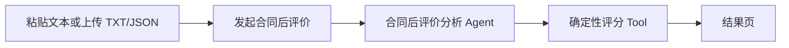

# SwarmCore Demo 开发文档

| 属性 | 值 |
|---|---|
| 状态 | DRAFT |
| 目标 | 用最小范围验证 SwarmCore 的核心业务价值 |
| Demo 场景 | 合同后评价 |
| 开发原则 | 单场景、单流程、单 Agent、单 Tool、可重复演示 |
| 事实来源 | [系统设计](./swarmcore-system-design.md)、[开发计划](./swarmcore-development-plan.md) |

## 0. 报告生成引导演示（2026-07-24）

| 属性 | 值 |
|---|---|
| 状态 | `VERIFIED / LOCAL` |
| 入口 | `/business-works/report-generation/demo` |
| 数据 | 采购履约后评价公开测试文件包（32 份）+ 明确标注的演示结构化记录 |
| 结果 | 七维评分、管理层摘要、关注项、证据说明、JSON 下载、浏览器打印/PDF |

该引导演示用于让用户不依赖项目配置和后台基础设施，手动走通“准备数据—智能分析—查看报告”
的最小产品闭环。它使用与后端确定性 Tool 一致的七维评价口径和固定示例结果，但不会创建真实
Case、Assessment 或 Run，不替代下文定义的运行时 Demo。

公开文件包包含不同真实项目和官方模板。页面明确区分同项目核心链路、跨项目规则/分类样本和
演示补充记录，禁止把混合语料报告解释为任何真实合同的正式履约结论。

验证结果：

- Web 单元测试：通过；
- Web 构建：通过；
- Playwright 主路径：desktop、tablet、mobile 通过；
- 全量 Web lint：被已有 `document-intake.test.tsx` 的 2 个 lint 错误阻塞；本次修改文件定向 lint 通过。

## 1. 文档目的

本文定义 SwarmCore Demo 的产品范围、技术边界、开发任务和验收标准。Demo 不承担 v1
平台完整性和生产资格验证，只证明以下核心价值链能够稳定运行：

> 用户提交一份文本或结构化合同资料，系统调用一个分析 Agent 和一个确定性评分 Tool，
> 最终展示合同后评价结果、风险和证据。

Demo 优先复用当前实现。现有通用能力原则上冻结、隐藏，不为缩减代码量进行大规模删除或重构。

## 2. 成功标准

Demo 完成后，演示人员应能在 5 分钟内完成以下流程：

1. 启动本地环境；
2. 打开合同后评价页面；
3. 粘贴文本，或上传一个 `.txt` / `.json` 文件；
4. 发起评价并看到运行状态；
5. 查看三个评价维度、总分、风险等级、摘要、关注项和证据；
6. 下载结构化 JSON 结果；
7. 使用 Fake Agent 连续重复执行，得到稳定且可解释的结果。

## 3. 范围

### 3.1 保留范围

| 能力 | Demo 要求 |
|---|---|
| 业务场景 | 只保留“合同后评价” |
| 输入 | 表单粘贴文本、`.txt`、`.json` |
| Agent | `agent://contract/post-evaluation-analyst@1` |
| Tool | 一个合同后评价确定性评分 Tool |
| Strategy | 一个内置、已发布、不可编辑的固定 Strategy |
| 节点 | 仅使用 `agent`、`tool` |
| 执行 | 复用现有 Run、Temporal Workflow 和状态投影 |
| 业务模型 | 内部复用 Case、Assessment、Run，对用户只展示“资料、评价、结果” |
| 结果 | 三维评分、总分、风险等级、摘要、关注项、证据和 JSON |
| 身份 | 本地固定 tenant/project，使用现有开发身份模式 |
| 模型 | Fake Agent 为默认路径；真实 OpenAI 兼容 Provider 为可选路径 |
| 存储 | PostgreSQL 和本地 Artifact 存储 |

### 3.2 冻结范围

以下能力保留现有代码，但不进入 Demo 页面、开发任务和验收范围：

- Strategy 画布和策略管理；
- Capability Center；
- Agent、Tool、Model 项目配置；
- Capability Pack 管理；
- Business Work 目录；
- DecisionAsset 管理；
- Finding 操作中心；
- Policy、Audit 和 Webhook 管理页面；
- approval、input、router、loop、parallel、join、reducer 节点；
- pause、resume、cancel 和 retry 的产品交互；
- MCP Demo 入口；
- 受控文件系统工具；
- 外部 Connector；
- 通用文档处理和 AI 质量评测平台。

冻结表示本轮不增加功能、不修饰体验、不扩大测试矩阵。若冻结功能阻塞 Demo 主链，只修复直接阻塞项。

### 3.3 明确不做

- PDF、Word、Excel、ODF 和图片解析；
- OCR；
- 表格恢复；
- 大文件分片；
- 多文件自动匹配；
- 文件版本管理页面；
- 七维完整合同后评价；
- 权重自定义；
- 多 Agent 协作；
- 多模型路由和自动降级；
- Prompt 管理；
- 外部 ERP、发票、风险和供应商系统接入；
- S3、Vault、OPA、ClamAV、NATS、Kubernetes、gVisor 生产资格；
- 高可用、容量、背压、灾难恢复和 SLO；
- 移动端专项适配；
- 对现有平台能力进行物理删除。

## 4. Demo 用户流程



### 4.1 输入

页面提供两种互斥输入方式：

1. 直接粘贴合同及履约摘要；
2. 上传一个 `.txt` 或 `.json` 文件。

单次只允许一个输入。Demo 默认最大文件大小为 1 MiB，拒绝空文件、无法解码的文本和不合法 JSON。

推荐 JSON 示例：

```json
{
  "contract": {
    "name": "示例采购合同",
    "requiredDocuments": ["合同正文", "验收单"]
  },
  "documents": [
    {"name": "合同正文", "available": true},
    {"name": "验收单", "available": true}
  ],
  "performance": [
    {"milestone": "设备交付", "status": "COMPLETED", "delayDays": 0}
  ],
  "risks": [
    {"title": "交付延期风险", "level": "LOW", "status": "CLOSED"}
  ]
}
```

文本输入由 Agent 转换成与上述语义等价的结构化结果。Fake Agent 使用固定、确定性的解析结果。

### 4.2 执行

固定 Strategy 只包含两个节点：

1. `agent`：提取合同、文件、履约和风险事实，输出符合固定 Schema 的结构化数据；
2. `tool`：校验结构化数据，计算分数、风险等级和关注项。

Strategy 随 seed 数据发布。Demo 页面不能编辑、切换或重新发布 Strategy。

### 4.3 结果

结果页至少展示：

- 执行状态；
- 总分；
- 风险等级；
- 文件完整性得分；
- 进度履约得分；
- 风险治理得分；
- Agent 摘要；
- 关注项；
- 每项结论引用的输入证据；
- 原始 JSON 结果下载。

失败时只展示稳定错误码、简明原因和“重新执行”入口，不展示内部堆栈。

## 5. Demo 评分规则

Demo 使用固定三维评分，不复用正式七维评价口径：

| 维度 | 权重 | Demo 规则 |
|---|---:|---|
| 文件完整性 | 30% | 已提供必需文件数 / 必需文件总数 |
| 进度履约 | 40% | 按期完成 100 分；逾期完成 50 分；未完成 0 分；未到期不计入分母 |
| 风险治理 | 30% | 按风险等级和关闭状态确定性扣分 |

约束：

- 三个维度原始分均为 0～100；
- 总分为三个维度的加权和，保留两位小数；
- 缺少某维度的必要事实时，不允许 Agent 补造；
- 必要事实不足时返回 `DATA_INSUFFICIENT`，并列出缺失字段；
- Agent 只负责提取和摘要，不得直接给出最终分数；
- Tool 是分数、风险等级和关注项的唯一事实来源。

风险等级固定映射：

| 总分 | 风险等级 |
|---:|---|
| 85～100 | LOW |
| 70～84.99 | MEDIUM |
| 0～69.99 | HIGH |

## 6. 最小技术方案

### 6.1 运行组件

Demo 只要求启动：

- Web；
- API；
- Control Worker；
- Agent Worker；
- Tool Worker；
- PostgreSQL；
- Temporal；
- 本地 Artifact 存储。

不要求启动 NATS、Vault、OPA、ClamAV、Phoenix、Grafana、Loki、Webhook Worker、S3 或 Sandbox
Manager。若当前进程启动存在硬依赖，应通过已有本地配置或最小适配解除，不建立第二套 Runtime。

### 6.2 服务复用

Demo 必须复用：

- `BusinessWorkService`；
- Case / Assessment 应用服务；
- Run Command Service；
- Temporal Runtime；
- Agno Adapter 或 Fake Agent Adapter；
- Tool Gateway 的现有执行契约；
- Assessment 和 Run 查询服务。

禁止在 Web、API Route 或 Demo 专用模块中复制评分、Run 状态机和业务持久化逻辑。

如现有 API 粒度导致前端调用步骤过多，可以增加一个薄的 Demo DTO Adapter，但它只能：

1. 校验 Demo 输入；
2. 调用现有应用服务创建 Case/Assessment；
3. 返回 Assessment ID 和 Run ID。

该 Adapter 不得包含评分规则、直接写数据库或旁路 Temporal。

### 6.3 API 使用范围

优先复用现有 API：

- 获取 `contract-post-evaluation` 业务工作；
- 创建 Case；
- 发起 Assessment；
- 查询 Run；
- 查询 Assessment；
- 下载结果 JSON。

Demo Web 不调用 Strategy、Capability Center、配置、Policy、Audit、Webhook 和 DecisionAsset API。
现有 OpenAPI 契约保持兼容。

### 6.4 数据模型

不新增 Demo 专用核心表。内部关系保持：

```text
Case → Assessment → Run → RunResult
```

文本或 JSON 输入保存在现有 Case/Revision payload 或现有 Blob/Document 引用中。最终结果写入现有
Evaluation/Assessment 结果结构。除非当前模型无法表达必要数据，否则不新增 Alembic migration。

### 6.5 Fake Agent

Fake Agent 是 Demo 的默认和强制验收路径：

- 不需要 API Key；
- 输入相同则输出相同；
- 输出满足固定 Schema；
- 能覆盖成功、资料不足和 Agent 失败三种 Fixture；
- 不模拟不在 Demo 范围内的 OCR、外部连接器或多 Agent 行为。

真实模型仅作为附加演示能力，不作为 Demo 完成门禁。

## 7. Web 页面

### 7.1 页面范围

只要求以下页面：

| 页面 | 责任 |
|---|---|
| Demo 首页 | 说明场景并进入评价 |
| 新建评价 | 粘贴文本或上传 TXT/JSON，提交执行 |
| 运行状态 | 展示排队、运行、成功或失败 |
| 评价结果 | 展示评分、摘要、关注项、证据和 JSON 下载 |

优先复用现有 `/workbench`、`/runs/:runId`、`/assessments/:assessmentId` 页面和组件。允许增加
`/demo` 入口，但不得复制现有运行查询和 Assessment 展示逻辑。

### 7.2 导航

Demo Shell 只显示：

- 合同后评价；
- 示例数据；
- 最近结果。

其他现有页面不从 Demo 导航暴露。暂不删除原路由，以避免引入大范围兼容修改。

### 7.3 状态展示

前端只映射四种用户状态：

| 用户状态 | 后端状态 |
|---|---|
| 等待执行 | ACCEPTED、VALIDATING、QUEUED |
| 正在分析 | RUNNING |
| 评价完成 | SUCCEEDED |
| 评价失败 | REJECTED、FAILED、CANCELLED、TIMED_OUT |

Demo 不提供暂停、取消、审批或补充输入按钮。

## 8. 开发任务

### D0：冻结 Demo 契约

- 固定输入 Schema；
- 固定 Agent 输出 Schema；
- 固定 Tool 输入输出 Schema；
- 固定三维评分规则；
- 固定错误码；
- 准备三个演示 Fixture。

退出条件：Schema 和 Fixture 通过单元测试，后续任务不再扩大业务范围。

### D1：固定执行链

- Seed 固定 Strategy；
- Seed 合同后评价 Pack 和项目绑定；
- Fake Agent 输出固定结构；
- 评分 Tool 实现三维确定性规则；
- Case → Assessment → Run → Result 闭环；
- 失败和资料不足结果可查询。

退出条件：API 层可完成一次成功评价和一次资料不足评价。

### D2：Demo 页面

- 精简导航；
- 新建评价表单；
- TXT/JSON 校验；
- 执行状态轮询；
- 结果页三维展示；
- 错误状态；
- JSON 下载；
- 示例数据一键填充。

退出条件：浏览器可以在不进入管理页面的情况下完成主流程。

### D3：一键启动

- 提供 Demo 环境示例配置；
- 默认启用 Fake Agent；
- Seed 命令幂等；
- 明确最小启动命令；
- 提供成功演示 Fixture；
- 删除 Demo 启动路径中的非必要服务硬依赖。

退出条件：干净环境按文档可在 5 分钟内启动并完成首次评价。

### D4：测试和交付

- 后端定向单元测试；
- 一个 PostgreSQL/Temporal 集成测试；
- 一个 Playwright 主路径；
- Fake Agent 连续执行稳定性测试；
- Web lint、test、build；
- Ruff、mypy；
- 更新 README 的 Demo 启动说明。

退出条件：全部 Demo 门禁绑定同一 commit；未执行的非 Demo 检查明确记录。

## 9. 测试范围

### 9.1 必须执行

```powershell
uv run ruff check .
uv run mypy
uv run pytest -q <demo相关单元测试>
uv run pytest -q <demo主链集成测试>
pnpm web:lint
pnpm web:test
pnpm web:build
pnpm web:e2e --grep "contract post evaluation demo"
```

### 9.2 必测场景

1. 合法 JSON 成功评价；
2. 合法文本经 Fake Agent 成功评价；
3. 缺少必要事实返回 `DATA_INSUFFICIENT`；
4. 非法 JSON 在提交前被拒绝；
5. 非 TXT/JSON 文件被拒绝；
6. Agent 失败进入稳定失败状态；
7. Tool Schema 校验失败不会产生伪造分数；
8. 相同输入使用不同幂等键可重复演示；
9. 相同幂等键不会创建重复评价；
10. 结果页和下载 JSON 使用同一事实结果。

### 9.3 本轮不要求

- 全量 Playwright；
- 移动端截图基线；
- 真实 Provider E2E；
- OCR 测试；
- NATS、Webhook 和 SSE 恢复测试；
- Kubernetes、Sandbox、Vault、OPA、ClamAV 测试；
- 容量、HA 和灾难恢复测试。

## 10. Demo 完成定义

只有同时满足以下条件，Demo 才能标记为 `IMPLEMENTED / LOCAL`：

- 只暴露约定的合同后评价主流程；
- 固定 Strategy 使用一个 Agent 和一个 Tool；
- TXT、JSON 和文本粘贴可用；
- 三维评分由确定性 Tool 生成；
- Assessment 和 Run 结果一致；
- Fake Agent 不依赖外部凭据；
- 主路径 Playwright 通过；
- 相关 Ruff、mypy、单元、集成、Web lint/test/build 通过；
- README 包含从零启动和演示步骤；
- 没有把未执行的生产资格检查描述为通过。

## 11. 变更控制

Demo 开发期间，以下需求默认拒绝进入当前范围：

- 新业务场景；
- 新节点类型；
- 新 Agent 或 Tool；
- 新文件格式；
- 新外部系统；
- 新管理页面；
- 新模型路由策略；
- 新生产基础设施。

新增需求必须明确替换现有范围，而不是叠加。Demo 验收完成后，再根据演示反馈决定是否恢复
完整七维评价、真实文档解析或平台管理能力。
