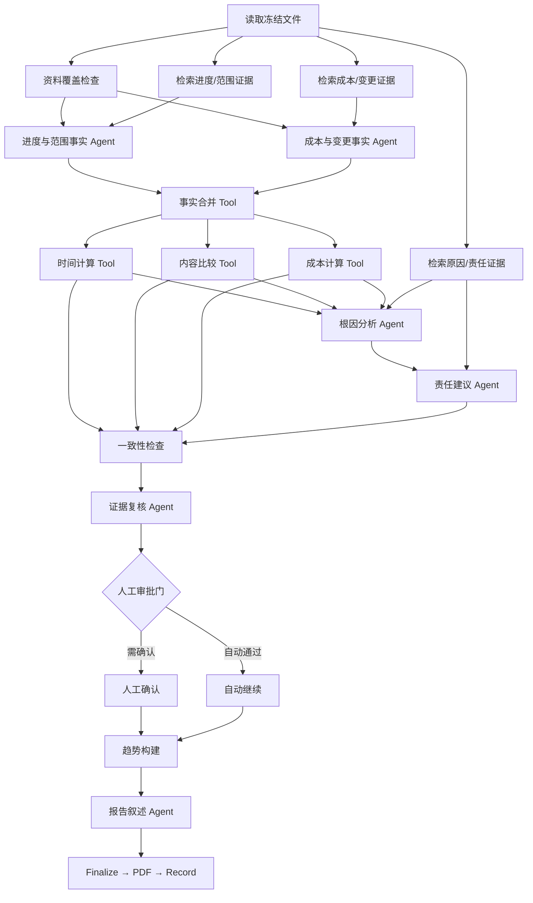

# SwarmCore 偏差分析智能体设计

状态：IMPLEMENTED / VERIFIED LOCAL  
目标业务：`deviation-analysis`  
能力包：`capability://deviation-analysis@1.0.5`

## 1. 结论

偏差分析作为独立 Capability Pack 落地，复用业务资料库、BusinessObject/Case、Assessment/Run、
Temporal、Tool Gateway、Model Gateway、Artifact 和人工审批，不建立独立微服务，也不把后评价
能力包复制一份。

关键边界：

1. 文件选择由确定性规则完成，Agent 不决定运行读取哪些文件。
2. 时间、内容、成本偏差和趋势序列由 Tool 计算，Agent 不计算最终数值。
3. Agent 负责从冻结证据中提取候选事实、生成根因假设、提出责任建议、复核证据和撰写叙述。
4. AI 只能输出 `PROPOSED` 责任建议；`CONFIRMED`、`DISPUTED` 必须由有权限的人设置。
5. 结构化 JSON 是唯一事实源；页面图表和 PDF 只渲染同一份冻结结果。
6. Assessment 必须冻结文件版本、处理结果、业务事实、配置、Agent、Tool、模型、Prompt 和策略版本。

## 2. 业务范围

### 2.1 输入

- 主体：合同、项目或订单，必须有一个 `PRIMARY` BusinessObject。
- 分析维度：`TIME`、`CONTENT`、`COST`，默认三项全选。
- 分析期间：`periodStart`、`periodEnd`。
- 截止时点：`asOf`，所有“实际”和“预测”均以此时点为准。
- 基准：范围基准、进度基准、成本基准及其批准变更。
- 实际：进度、交付、验收、成本、承诺、付款等事实。
- 辅助证据：变更审批、问题单、会议纪要、往来函件、整改记录、责任矩阵。
- 项目运行配置：币种、时区、偏差阈值、趋势窗口、人工审批规则。

### 2.2 输出

- 时间偏差：节点提前/延迟、按期率、关键路径影响、可选 SPI。
- 内容偏差：缺失、部分完成、拒收、超范围、未批准变更和加权完成度。
- 成本偏差：当前批准预算、实际成本、剩余承诺、EAC、超支额/率、可选 CV/CPI。
- AI 根因分析：原因链、证据、影响、备选解释、置信状态。
- 趋势：时间、内容、成本的周期快照和变化方向。
- 责任归属：AI 建议、人工确认结果、责任比例、意见和状态。
- Findings、纠正措施、结构化 JSON、在线图表和 PDF 报告。

### 2.3 非目标

- 不让模型补造缺失的计划、成本、日期或责任事实。
- 不用发票金额代替实际成本，不用付款金额代替已完成价值。
- 不由 AI 做法律责任、违约责任或人员绩效的最终裁定。
- 不直接修改计划、预算、合同、ERP 或项目管理系统。
- 不在 Temporal Workflow 中访问文件、数据库、模型或当前时间。

## 3. 文件怎么选

### 3.1 资料槽位

Manifest 按分析维度声明资料要求。`FULL` 模式要求三个基准槽位，并要求至少存在一类对应实际资料；
单维模式只校验所选维度。

| 槽位 | 分类 | FULL 要求 | 建议上限 | 典型文件 |
|---|---|---:|---:|---|
| `scope-baseline` | `SCOPE_BASELINE` | 1 | 10 | 合同、SOW、技术规格、清单、批准补充协议 |
| `schedule-baseline` | `SCHEDULE_BASELINE` | 1 | 10 | 里程碑计划、批准基准计划、进度表 |
| `cost-baseline` | `COST_BASELINE` | 1 | 10 | 合同价、预算、BOQ、批准成本基准 |
| `progress-actual` | `PROGRESS_ACTUAL` | 1 | 50 | 周报、月报、任务完成记录、实际日期 |
| `delivery-acceptance` | `DELIVERY_ACCEPTANCE` | 1 | 50 | 交付清单、验收单、质量结论 |
| `cost-actual` | `COST_ACTUAL` | 1 | 50 | 实际成本、承诺成本、付款和预测成本明细 |
| `approved-change` | `APPROVED_CHANGE` | 0 | 30 | 变更单、签证、批准函 |
| `cause-evidence` | `CAUSE_EVIDENCE` | 0 | 50 | 问题单、纪要、函件、停工或整改记录 |
| `responsibility-basis` | `RESPONSIBILITY_BASIS` | 0 | 20 | RACI、职责约定、组织职责、经确认的责任意见 |
| `supplemental-facts` | `SUPPLEMENTAL_FACTS` | 0 | 20 | 已确认 JSON、CSV、系统导出 |

默认接收 PDF、DOCX、XLSX、CSV、JSON、TXT 和 Markdown。扫描件和图片必须先经过 Document
Intelligence/OCR；Agent 不直接消费未经处理的二进制文件。

### 3.2 选择流程

1. 用户先选择主体、分析期间、截止时点和分析维度。
2. `DocumentLibraryService` 只查询同 tenant/project、绑定 `deviation-analysis` 且关联当前
   BusinessObject 的文件；临时 Subject 没有关联文件时，才允许回退到同业务工作绑定。
3. 只保留 Blob 为 `AVAILABLE`、病毒扫描为 `CLEAN`、未过保留期，且文件状态为
   `AVAILABLE` 或 `REVIEW_REQUIRED` 的当前版本。
4. 使用已确认分类优先匹配资料槽位；未确认的低置信分类不得自动满足必选槽位。
5. 基准文件按“明确固定 > 精确主体关联 > 已确认分类 > 已批准状态 > 生效时间匹配”推荐。
   同一逻辑基准存在多个候选时必须由用户确认，不能静默选择“最新文件”。
6. 实际资料按“精确主体关联 > 已确认分类 > 业务日期在分析期间内 > 版本号倒序 >
   Document ID”稳定排序和截断。被截断文件数量及原因必须展示并审计。
7. 用户可以排除候选或固定特定版本；排除必选资料后，提交前必须显示缺口。
8. Workbench 创建 Assessment 时写入 `DocumentUsageSnapshot`，冻结
   `documentVersionId/blobId/sha256/mediaType/sizeBytes`、处理结果版本和选择原因。
9. Temporal 运行只读取冻结快照；运行期间上传的新版本不进入本次分析。

文件选择清单本身也要计算 `selectionManifestHash`。相同主体、期间、配置和选择清单使用相同
幂等键，防止重复发起不同结果的“同一次分析”。

### 3.3 基准规则

- `originalBaseline` 保存原始批准基准。
- `currentBaseline = originalBaseline + approvedChanges(asOf)`。
- 未批准、撤回或批准日期晚于 `asOf` 的变更不进入当前基准，只作为偏差或风险。
- 基准的批准状态、生效日期或版本存在冲突时，结果标记 `BASELINE_AMBIGUOUS` 并进入人工审批。
- 重新选择基准必须创建新 Assessment，不能修改已有结果。

## 4. 事实与计算口径

所有数值 Tool 使用 Decimal、明确币种和时区；跨币种未提供冻结汇率时不合并。

### 4.1 时间

- `varianceDays = actualOrForecastDate - currentBaselineDate`，正数表示延迟，负数表示提前。
- `onTimeRate = onTimeDueMilestones / dueMilestones`。
- 只有依赖关系、工期和日历完整时才计算 `criticalPathImpactDays`，否则为 `null` 并输出
  `CRITICAL_PATH_DATA_INSUFFICIENT`。
- 只有输入包含 PV 和 EV 时才计算 `SPI = EV / PV`；不以模型估计 PV/EV。

### 4.2 内容

交付项状态默认映射为：`ACCEPTED=1`、`CONDITIONAL=0.5`、`DELIVERED_PENDING=0.25`、
`MISSING/REJECTED=0`。项目可发布新规则版本，但不能在单次运行中临时改变口径。

- `weightedActual = sum(weight × statusScore) / sum(weight)`。
- `contentVariance = weightedActual - plannedCompletionAtAsOf`。
- 已批准变更进入当前范围；未批准新增、删减或替换分别输出，不抵消原范围缺失。
- 无显式权重时按交付项等权，并在结果中输出 `DEFAULT_EQUAL_WEIGHT_USED`。

### 4.3 成本

- `currentBAC = originalBAC + approvedChangeAmount`。
- `forecastOverrun = EAC - currentBAC`。
- `forecastOverrunRate = forecastOverrun / currentBAC`。
- 有 EVM 数据时额外计算 `CV = EV - AC`、`CPI = EV / AC`。
- `remainingCommitment` 与 `AC` 分列，避免同一金额重复累计。
- 发票、付款、承诺和实际成本保持不同字段；只有经配置确认的映射才能纳入 AC。

### 4.4 趋势

趋势 Tool 读取同 tenant/project、同主体、同基准哈希和同口径版本的已完成 Assessment，
按 `asOf` 形成时间序列。首次运行只输出单点和 `TREND_HISTORY_INSUFFICIENT`。图表不得混合不同币种、
时区、基准或规则版本；需要跨基准观察时另输出带断点的“重基线视图”。

## 5. Agent 怎么配

建议使用 6 个窄职责 Agent。所有 Agent 使用 `node_only` 上下文和结构化输出 Schema，不接收完整
Run 输入，不直连数据库、文件系统或外部系统。

| Agent | 职责 | 输入 | 禁止 |
|---|---|---|---|
| `agent://deviation/schedule-scope-fact-analyst@1` | 提取里程碑、交付项、计划/实际日期、验收状态 | 覆盖诊断及进度/范围 Top-K 证据 | 计算最终偏差、判责 |
| `agent://deviation/cost-change-fact-analyst@1` | 提取预算、实际、承诺、预测和批准变更 | 成本/变更 Top-K 证据 | 把发票直接当成本、计算最终指标 |
| `agent://deviation/root-cause-analyst@1` | 基于确定性偏差和原因证据提出原因链、影响及备选解释 | 三维计算结果、原因证据、冲突 | 无引用断言根因 |
| `agent://deviation/responsibility-analyst@1` | 将已支持的原因与职责证据映射为责任建议 | 根因、RACI/职责证据、主体关系 | 输出已确认责任或法律结论 |
| `agent://deviation/evidence-reviewer@1` | 检查引用、冲突、覆盖、单一来源和高影响低置信结论 | 全部结构化事实和诊断 | 改写计算结果 |
| `agent://deviation/report-narrator@1` | 对冻结结果生成管理摘要、原因说明和建议 | 审批后的结构化结果 | 修改指标、责任状态、证据 |

Agent 配置原则：

- 事实 Agent 的 Tool allowlist 只包含只读证据检索；有副作用的 Tool 必须是显式 Strategy Tool 节点。
- 每个事实必须携带 immutable `documentVersionId`、定位信息和证据摘录哈希。
- 根因输出必须包含 `causeCategory`、`causalChain`、`supportingEvidence`、
  `alternativeExplanation`、`confidenceBand` 和 `qualityFlags`。
- 责任输出必须包含 `partyId/role/shareProposal/basisEvidence/status=PROPOSED`；证据不足时使用
  `UNASSIGNED`，禁止按常识猜测。
- 模型只使用 Registry 中已发布的逻辑模型引用；项目绑定可在就绪范围内解析 Provider，但 Run
  必须冻结实际模型、Provider 和 Prompt 版本。

## 6. 工具怎么配

优先复用现有通用 Tool；现有后评价 Tool 口径不足时新增偏差分析专用 Tool，不改变历史版本语义。

### 6.1 复用

| Tool | 用途 | 风险 |
|---|---|---|
| `tool://document/read-versions@1` | 读取冻结文件与处理结果 | LOW，只读 |
| `tool://document/coverage-check@1` | 校验资料槽位、可读性和覆盖率 | LOW，只读 |
| `tool://evidence/search@1` | 在冻结文件内按域检索 Top-K 证据 | LOW，只读 |
| `tool://evidence/consistency-check@1` | 校验证据引用、冲突和置信问题 | LOW，只读 |

### 6.2 新增

| Tool | 用途 | 关键要求 |
|---|---|---|
| `tool://deviation/facts-merge@1` | 合并两类事实 Agent 输出 | Schema 校验、去重、保留冲突 |
| `tool://deviation/time-calculate@1` | 计算日期、按期率、关键路径、可选 SPI | Decimal/日期确定性 |
| `tool://deviation/content-compare@1` | 基准交付项与实际/验收逐项匹配 | 匹配规则版本化，禁止模糊结果直接入账 |
| `tool://deviation/cost-calculate@1` | 计算 BAC、AC、EAC、CV、CPI 和超支 | 币种、汇率和金额来源校验 |
| `tool://deviation/history-read@1` | 读取可比较历史 Assessment | tenant/project/subject/口径隔离 |
| `tool://deviation/trend-build@1` | 生成页面/PDF共用趋势序列 | 不混合不同基准和规则版本 |
| `tool://deviation/responsibility-aggregate@1` | 聚合建议与人工决定 | 建议和确认分栏，比例校验 |
| `tool://deviation/finalize@1` | 生成最终结构化结果 | 不可变、幂等 |
| `tool://report/render-deviation-analysis@1` | 从最终 JSON 渲染 CJK PDF | 确定性模板 |
| `tool://workbench/record-deviation-analysis@1` | 持久化 Evaluation/Report/Finding | HIGH，EffectJournal、审计 |

读 Tool 可由 Agent allowlist 调用；计算 Tool 建议全部作为显式节点，便于重放和定位；持久化 Tool
必须经过 Capability Token、OPA、幂等键、EffectJournal 和审计。

## 7. 运行策略如何定义

当前策略：`strategy://deviation-analysis/execute@6`。



建议预算：

```json
{
  "maxDuration": "PT30M",
  "maxTokens": 160000,
  "maxCostUsd": 2.0,
  "maxAgents": 6,
  "maxParallelism": 4,
  "onExhausted": "wait_for_budget_approval"
}
```

运行控制：

- 证据检索扫描全部冻结文件，但每个域默认只向事实 Agent 注入 Top 8 命中；其余文件仍保留在覆盖清单。
- 两个事实 Agent 并行；时间、内容、成本三个计算 Tool 并行。
- Agent 超时 300 秒，Tool 超时 300 秒；重试只针对可重试的 Provider/网络错误。
- Workflow 只保存稳定引用和节点状态；文件、数据库、模型及时间访问均在 Activity/Tool。
- 重跑默认创建新 Assessment；相同节点输入哈希可复用幂等 Tool 结果，但不复用未冻结的模型输出。
- 大上下文、图表数据和报告进入 Artifact；Run 内联输入/输出遵守平台上限。

## 8. 人工审批与责任归属

满足任一条件进入 Approval：

- 基准冲突或必需资料不足；
- 高/关键偏差只有单一证据来源；
- 根因或责任证据存在冲突；
- AI 建议了具体责任主体但没有有效职责依据；
- 责任建议包含 `HIGH` 影响且 `confidenceBand != HIGH`；
- 成本超支率、关键路径影响或内容缺失超过项目审批阈值；
- 证据复核 Agent 或一致性 Tool 输出阻塞质量标记；
- 预算耗尽或关键节点降级。

审批人可以确认、驳回、改派、调整比例、补充意见或要求补资料。人工决定作为独立只追加记录保存，
不覆盖 AI 原始建议。责任状态：

`PROPOSED → CONFIRMED | DISPUTED | UNASSIGNED`

最终报告必须同时展示“AI 建议”和“人工确认”；没有确认时不得使用“责任已认定”文案。

## 9. 配置放在哪里

| 配置对象 | 保存内容 | 版本策略 |
|---|---|---|
| Capability Manifest | 输入/输出 Schema、资料槽位、权限、报告和 View 引用 | 发布后不可变 |
| StrategyVersion | DAG、节点输入映射、超时、重试、预算、路由条件 | 编译并冻结 |
| Agent Registry | role、instructions、model、tools、输出 Schema | 显式 `@version` |
| Tool Registry | operation、Schema、风险、幂等和恢复策略 | 显式 `@version` |
| Project Capability Binding | 阈值、币种、时区、趋势窗口、权重、审批策略 | Run 冻结配置哈希 |
| Workbench Run Input | 主体、期间、asOf、维度、用户固定/排除的文件 | Assessment 冻结 |
| Decision Asset | 状态映射、阈值、责任分配校验规则 | 仅发布版本可运行 |

建议项目配置：

```json
{
  "dimensions": ["TIME", "CONTENT", "COST"],
  "timezone": "Asia/Shanghai",
  "currency": "CNY",
  "trendWindow": "P6M",
  "evidenceTopK": 8,
  "thresholds": {
    "delayDaysHigh": 15,
    "contentVarianceRateHigh": 0.1,
    "forecastOverrunRateHigh": 0.05
  },
  "approval": {
    "requireResponsibilityConfirmation": true,
    "requireHighImpactReview": true
  }
}
```

阈值由已发布配置或 Decision Asset 决定，不写入 Prompt。

## 10. 结果契约

建议输出 Schema：`schema://deviation-analysis/result@1`。

```json
{
  "assessment": {
    "subjectId": "uuid",
    "periodStart": "2026-01-01",
    "periodEnd": "2026-06-30",
    "asOf": "2026-06-30T23:59:59+08:00",
    "baselineHash": "sha256",
    "selectionManifestHash": "sha256"
  },
  "coverage": {},
  "time": {"status": "OK", "metrics": {}, "items": []},
  "content": {"status": "OK", "metrics": {}, "items": []},
  "cost": {"status": "OK", "currency": "CNY", "metrics": {}, "items": []},
  "rootCauses": [],
  "responsibility": {
    "proposals": [],
    "decisions": [],
    "status": "PENDING_CONFIRMATION"
  },
  "trends": {},
  "findings": [],
  "actions": [],
  "evidence": [],
  "qualityFlags": [],
  "provenance": {},
  "artifacts": []
}
```

每个维度独立返回 `OK | DATA_INSUFFICIENT | CONFLICTED | NOT_APPLICABLE`，禁止因为一个维度缺资料
而把其他已验证维度伪装成完整失败或完整成功。

## 11. 页面与报告

Workbench 分四步：

1. 选择主体、期间、截止时点和维度；
2. 查看系统推荐文件，确认三个基准，处理缺口/冲突；
3. 配置阈值和审批人，预览冻结清单与预计预算；
4. 提交后进入统一 Run 详情，审批完成后查看 Assessment。

结果页建议包含：

- 总览：三维状态、重大偏差、资料覆盖和待审批数；
- 时间：里程碑基准/实际时间线、延迟分布、关键路径；
- 内容：交付项匹配表、完成度堆叠、未批准范围变化；
- 成本：原始预算/批准变更/当前预算/EAC 瀑布图；
- 趋势：时间、内容、成本同口径序列；
- 根因：原因 Pareto、因果链、备选解释和证据；
- 责任：AI 建议与人工确认对照矩阵；
- 证据与审计：文件版本、定位、哈希、规则和模型来源。

图表数据全部来自 `trends` 和三维 `metrics`，不由报告 Agent 生成。

## 12. 权限、安全与审计

建议权限：

- `deviation.read`
- `deviation.assess`
- `document.read`
- `business-object.read`
- `responsibility.propose`
- `responsibility.confirm`
- `finding.act`
- `report.read`

Agent 只获得运行级短期 Capability Token。所有数据访问保留 tenant/project 边界；日志不记录原始文件
正文、Prompt、Secret 或外部系统完整响应。审计至少记录文件选择、基准确认、配置哈希、计算 Tool
版本、责任建议、人工改判、报告哈希和下载。

## 13. 实施切片

### DA-1：契约与确定性计算

- 新增 `packages/capability-deviation-analysis/` 的 Manifest、Strategy、Schema、View 和报告模板。
- 注册资料槽位、Agent/Tool 引用。
- 实现时间、内容、成本、趋势和责任聚合 Tool 及单元测试。
- 建立脱敏黄金样本，先验证公式和边界，再接模型。

### DA-2：证据与 Agent

- 接入业务资料库处理结果和冻结快照。
- 实现两个事实 Agent、根因 Agent、责任 Agent、复核 Agent、报告 Agent。
- 验证引用有效率、事实准确率、幻觉率、根因可支持率和责任建议可追溯率。

### DA-3：Workbench、审批与报告

- 完成文件选择、基准冲突、执行、审批、趋势和报告页面。
- 接入 Evaluation、Finding、Artifact、Outbox 和审计。
- 完成 CJK PDF、图表与 JSON 同源校验。

### DA-4：生产资格

- PostgreSQL/RLS、Temporal Replay、Provider/Tool 故障、幂等、预算、恶意文件和跨租户测试。
- 使用真实业务样本完成专家盲评和阈值校准。
- 只有实现与对应测试通过后，才能在开发计划中标记 `IMPLEMENTED` 或 `VERIFIED`。

## 14. 验收标准

- 同一冻结输入、规则和 Tool 版本的三维计算结果可重复。
- 每个数值、根因和责任建议均能追溯到文件版本或已确认业务事实。
- 基准冲突、币种冲突、证据不足和责任未确认不会被静默忽略。
- AI 无法修改最终指标、趋势点、责任确认状态或报告事实。
- 页面图表、JSON、PDF 的指标与责任状态一致。
- 运行重试不重复持久化 Finding、责任决定或 Artifact。
- 跨 tenant/project 访问、未授权责任确认和未扫描文件读取均被拒绝并审计。
