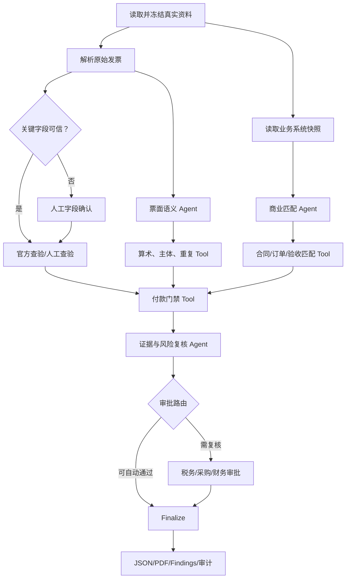

# 智能体业务开发功能设计文档

## 1. 需求概述

### 1.1 业务目标

在付款审批前，对供应商发票执行“原件识别—官方查验—业务单据匹配—合规与付款条件校验—
风险分级—人工处置—报告留痕”的完整闭环，减少假票、重复报销、错票、超合同/超订单开票、
未验收先付款和收款账户异常等风险。

本能力以 `invoice-assurance` Capability Pack 接入 SwarmCore，复用业务资料库、
BusinessObject/Case、Assessment/Run、Temporal、Model Gateway、Tool Gateway、Artifact、
Approval、Finding、Outbox 和审计，不建立发票专用微服务。REST 与 MCP 复用
`BusinessWorkService`、`CaseService` 和 `WorkbenchService`。

### 1.2 目标用户

- 应付会计：提交发票及业务资料，处理字段与查验异常。
- 采购/合同经办人：确认订单、收货、验收、变更和付款条款。
- 财务复核/付款审批人：确认例外是否允许进入付款队列。
- 内控/审计人员：查看规则、证据、人工决定和历史结果。
- 项目管理员：配置数据连接、阈值、模型、工具和审批角色。

### 1.3 输入

- 发票原始电子文件；优先 XML，其次 OFD/PDF，纸票扫描件或图片仅作为兼容输入。
- 合同、补充协议、采购订单及变更单。
- 收货单、服务确认单、验收单、工时/进度证明。
- 供应商主数据、统一社会信用代码、已批准收款账户及账户变更审批。
- 应付发票台账、历史报销/入账/付款记录、红字发票及冲销关系。
- 预算、付款计划、预付款、质保金、扣款和审批规则。
- 税务数字账户的授权导出，或全国增值税发票查验平台的人工查验结果。

### 1.4 输出

- 发票结构化事实、每个字段的来源位置和置信状态。
- 官方查验状态和查验时间，不把“票面信息一致”扩大解释为交易真实。
- 票面、主体、合同/订单、履约/验收、金额/税额、重复性和付款条件的逐项结果。
- 总体结论：`PAYMENT_READY`、`REVIEW_REQUIRED` 或 `PAYMENT_BLOCKED`。
- 风险项、严重级别、阻断原因、建议动作、负责人和处理期限。
- 可下载的结构化 JSON 与中文 PDF 报告；页面、PDF 和 API 使用同一冻结结果。
- 可追溯的文件快照、数据源快照、规则/模型/工具/Prompt 版本、Tool 调用和人工决定。

### 1.5 成功定义

使用至少一张经授权的真实业务发票及其真实合同/订单/验收/供应商/应付数据完成一次运行；
系统实际读取原件和业务系统快照，调用解析、官方查验或人工查验、匹配、规则计算和报告工具，
并在界面展示节点过程、输入输出摘要、证据定位、版本哈希和最终付款前结论。Demo 不发起付款。

## 2. 自主决策与关键假设

| 决策/假设 | 依据 | 影响 | 验证方式 |
|---|---|---|---|
| 地域限定为中国大陆、币种默认 CNY、时区 `Asia/Shanghai` | 需求使用中文“发票”，且现有业务工作为中国项目语境 | 规则与资料源采用中国税务和会计口径 | 项目配置可改币种；境外票据不进入本 Demo |
| Demo 主类型为数电发票和增值税电子发票 | 数电发票自 2024-12-01 起全国推广；仍需兼容存量票 | 优先使用结构化原件，纸票只做兼容 | 用一份 XML 数电发票和一份 PDF/OFD 或扫描件验证 |
| 官方查验平台不是公开机器 API | 官方页面公开的是网页查验，存在 JS、验证码、次数限制；未查到公开批量 API 契约 | 不抓取、不绕过验证码；采用授权税务连接器或人工协助 | 接入前由法务/税务与服务商验证授权和接口合同 |
| 官方查验只证明平台返回的票面信息 | 官方查验说明明确平台仅提供票面信息查验结果 | 仍须做合同、履约和付款条件校验 | 报告把 `OFFICIAL_FACE_MATCHED` 与业务真实性分栏 |
| 付款条件由企业政策决定，不由模型生成 | 不同企业的合同、授权和内控要求不同 | 规则来自发布后的 Decision Asset | 项目管理员发布规则；运行冻结版本与哈希 |
| 模型不做金额、税额、重复和最终阻断判定 | 这些结论可由确定性规则稳定计算 | Agent 只处理低置信字段、语义匹配和叙述 | 金额 Golden Case 和属性测试必须不依赖模型 |
| Demo 使用客户授权的真实交易资料 | 公开标准实例可验证解析器，但不是客户真实交易 | 官方样例不冒充真实业务输入 | 验收记录来源系统、授权人、哈希和脱敏展示策略 |
| 不直接调用银行付款 | 付款为不可逆高风险外部写入，且需求是“付款前置条件校验” | 输出仅为付款建议和风险状态 | Tool allowlist 中不存在付款执行 Tool |

## 3. Demo 范围

### 3.1 范围内

1. 单一企业租户、单项目、单发票 Case；一张发票可关联一份合同、一个或多个采购订单和验收记录。
2. 数电发票 XML、增值税电子发票 OFD/PDF，以及纸票扫描 PDF/JPEG/PNG。
3. 真实文件上传；ERP/采购/财务数据通过只读 API 或原系统导出的 CSV/JSON/XLSX 接入。
4. 官方查验采用两种可替换模式：
   - `AUTHORIZED_CONNECTOR`：企业有合法税务数字账户或合规服务商接口时自动获取。
   - `HUMAN_ASSISTED`：用户在官方页面完成验证码和查验，上传/确认查验回执。
5. 票面与税额、主体、重复、合同/订单、收货/验收、累计开票付款、收款账户、预算和审批条件校验。
6. 低置信或高风险人工审批、Finding 跟踪、JSON/PDF 报告和全程审计。

### 3.2 边界

- 支持红字发票与原蓝字发票的关联检查，但不代替纳税申报和进项抵扣用途确认。
- 企业状态查询作为增强项，只读使用国家企业信用信息公示系统；无法自动访问时进入人工核验。
- 税率规则只校验已发布规则集与票面算术，不由模型判断复杂税务筹划是否合法。
- 允许一票多订单的确定性分摊；一订单多票通过累计台账检查。

### 3.3 Demo 约束

- 必须使用经授权的真实发票和真实业务数据；财政部标准包中的实例仅用于解析器契约测试。
- 外部连接不可用时可展示真实失败与人工恢复，不用 Fake Connector 冒充成功。
- 敏感数据只在受控环境展示；演示录屏可遮罩银行账号、手机号和地址，但后台证据保留原值哈希。
- 设计状态为 `DESIGNED / NOT IMPLEMENTED`，不得在开发计划中标为 `IMPLEMENTED` 或 `VERIFIED`。

## 4. 业务角色

| 角色 | 职责 | 最小权限 | 目标 |
|---|---|---|---|
| AP 经办人 | 建 Case、绑定资料、确认抽取字段、补充官方查验 | `case.create/read`、`document.read`、`invoice.submit` | 完整提交且快速修正资料问题 |
| 采购/合同复核人 | 确认订单、变更、验收与商业例外 | `invoice.commercial-review` | 避免超范围、未验收开票 |
| 财务审批人 | 处理付款阻断与允许例外 | `invoice.payment-review`、`approval.respond` | 只放行满足政策的发票 |
| 税务复核人 | 处理查验、红冲、税率和凭证问题 | `invoice.tax-review` | 防止无效或不合规凭证入账 |
| 内控/审计员 | 只读检查证据与审计日志 | `invoice.audit`、`report.read` | 重现任一结论 |
| 项目管理员 | 绑定数据源、发布规则和模型路由 | `configuration.manage`、`decision-asset.publish` | 配置可用但不能审批自己的业务 Case |
| 系统服务身份 | 只读取绑定数据、执行规则、写结果 | 短期 Capability Token | 最小权限、租户/项目隔离 |

## 5. 最小完整业务闭环

1. AP 经办人选择“发票一致性校验”，上传真实发票原件并选择供应商/合同/订单。
2. 系统校验文件可用性、病毒扫描和资料槽位；从同 tenant/project 的业务资料库读取关联资料。
3. 系统冻结 `DocumentUsageSnapshot`、业务对象版本、连接器读取结果、规则版本和配置哈希。
4. 解析 Tool 优先读取 XML/XBRL/电子签名与元数据；无结构化数据时执行 PDF/OFD 解析或 OCR。
5. 关键字段低置信或多来源冲突时暂停，由经办人逐字段确认；确认产生追加证据，不覆盖原始抽取。
6. 系统调用授权税务连接器；若未配置，则创建官方查验人工任务。查验结果保存时间、操作者、
   输入字段、结果摘要、来源 URL 和证据哈希。
7. 系统读取供应商、合同/订单、收货/验收、历史发票/付款、预算和账户审批的真实快照。
8. 两个 Agent 并行处理票面语义规范化与商业单据的歧义匹配；所有候选匹配必须携带证据。
9. 确定性 Tool 执行算术、主体、重复、二/三/四单匹配、累计金额、税务规则和付款条件校验。
10. 证据复核 Agent 检查引用、冲突和未支持结论；规则引擎计算最终状态和风险级别。
11. `PAYMENT_READY` 自动生成报告；`REVIEW_REQUIRED` 或 `PAYMENT_BLOCKED` 进入相应角色审批。
12. 审批人可确认、驳回、要求补资料或批准有限例外；不可覆盖的硬阻断只能补正后新建 Assessment。
13. Finalize Tool 生成不可变结果，报告 Tool 渲染 JSON/PDF，Recorder 写入 Evaluation、Finding、
    Artifact、Outbox 和 Audit。
14. 完成条件：运行 `SUCCEEDED` 且业务结论、证据和人工决定可读；或明确终止为
    `FAILED/CANCELLED` 并保留失败证据。成功运行不等于允许付款。

## 6. 功能清单

| 优先级 | 功能 | 使用者 | 输入与处理 | 输出 | 依赖 |
|---|---|---|---|---|---|
| P0 必需 | 原件接入与冻结 | AP | 上传/绑定，病毒扫描，版本哈希 | 不可变文件快照 | Document Library、Blob |
| P0 必需 | 结构化解析/OCR | 系统/AP | XML 优先，OFD/PDF，OCR 降级，字段确认 | InvoiceFactSet | Parser/OCR Adapter |
| P0 必需 | 官方查验 | 系统/税务复核 | 授权接口或人工官方页面 | VerificationEvidence | 税务连接或 Approval |
| P0 必需 | 票面算术与主体校验 | 系统 | 金额、税额、号码、购销方信息 | RuleResult[] | 规则 Tool |
| P0 必需 | 重复与红冲检查 | 系统 | 当前票、历史发票、付款台账 | 重复/冲销链结论 | AP Ledger |
| P0 必需 | 合同/订单/验收匹配 | 系统/采购 | 行项目、数量、单价、税率、累计金额 | MatchResult[] | ERP/采购/验收 |
| P0 必需 | 付款前置条件 | 系统/财务 | 到期日、预算、审批、账户、预付款/质保金 | GateResult[] | 财务政策 |
| P0 必需 | 风险分级与人工审批 | 财务/税务/采购 | 规则结果、证据和阈值 | 决定与 Findings | Approval、Decision Asset |
| P0 必需 | 报告与追溯 | 全角色 | 冻结结构化结果 | 页面、JSON、PDF、审计 | Artifact、Audit |
| P1 | 企业公示状态核验 | 税务/采购 | 名称/统一社会信用代码 | 状态和人工证据 | GSXT |
| P1 | 批量队列 | AP | 多张发票 | 每票独立 Case 与汇总 | 并发/配额 |
| P2 | 规则命中趋势 | 内控 | 历史 Assessment | 风险趋势 | 分析投影 |

## 7. 真实数据与资料方案

### 7.1 官方与外部资料

| 用途 | 具体来源及访问地址 | 真实数据证明 | 接入/权限 | 字段与更新 | 缓存/替代 | 合规要求 |
|---|---|---|---|---|---|---|
| 数电发票制度与字段 | [国家税务总局公告 2024 年第 11 号](https://shanxi.chinatax.gov.cn/zdgk/detail/sx-11400-545-1801545) | 官方公告明确数电发票定义、20 位号码、票面字段、红冲、下载和查验渠道 | 公网只读；作为 RuleSet 依据 | 发布后版本化；法规管理员季度复核 | 保存 URL、抓取时间和内容哈希；税总主站为替代 | 不把公告内容交给模型临时解释为规则 |
| 官方票面查验 | [全国增值税发票查验平台](https://inv-veri.chinatax.gov.cn/)及[查验说明](https://inv-veri.chinatax.gov.cn/fpcysm.html) | 官方说明覆盖票种、近 5 年范围、每票每日 5 次，且仅提供票面查验结果 | 授权连接器或人工完成验证码；不共享个人登录凭据 | 发票号码/代码、日期、金额/校验码、查验状态、时间 | 同票同日结果缓存；超次数次日继续；疑义持原件向税务机关鉴定 | 禁止绕过验证码、批量爬取或扩大结果含义 |
| 结构化格式、元素和实例 | [财政部电子凭证会计数据标准（推广应用版）](https://kjs.mof.gov.cn/zt/kuaijixinxihuajianshe/dzpzkjsjbzshsd/sjbz/202505/t20250519_3964020.htm) | 官方页面提供数电发票、增值税电子发票标准 ZIP、指南、元素清单和实例 | 公网下载；发布包写入受控知识资料库 | Schema、元素表、实例；检测新版本后人工发布 | 固定 ZIP SHA-256；旧版保留 | 官方实例仅做解析器测试，不冒充真实交易 |
| 电子凭证处理要求 | [财政部等九部门财会〔2025〕9号](https://www.mof.gov.cn/jrttts/202505/t20250521_3964264.htm) | 官方说明支持 XML、XBRL、OFD/PDF 内嵌结构化数据和全流程处理 | 公网只读 | 年度复核 | 保存版本与哈希 | 原始电子凭证及元数据不得只留截图 |
| 电子发票报销归档 | [电子发票全流程电子化管理指南](https://dzsws.mofcom.gov.cn/gztz/art/2023/art_a68f3d79e9524456b29d029884726fd8.html)、[财会〔2020〕6号答问](https://www.chinatax.gov.cn/chinatax/n810341/n810760/c5161389/content.html) | 四部门指南与三部门答问要求查验真实、完整接收元数据、防篡改、防重复入账和保存电子原件 | 公网只读 | 年度复核 | 规则资产引用条款与版本 | PDF 打印件不能替代接收的电子原件 |
| 发票法定基础 | [《中华人民共和国发票管理办法》](https://xinjiang.chinatax.gov.cn/sszc/zxwj/202311/t20231114_122775.htm)、[实施细则](https://www.chinatax.gov.cn/chinatax/n810214/n810641/c102061/c102062/c5171582/content.html) | 税务机关官网发布的现行制度和基本内容 | 公网只读 | 法规变更触发新规则版本 | 旧规则按生效期保留 | 复杂税务结论由税务人员确认 |
| 企业主体状态增强核验 | [国家企业信用信息公示系统](https://www.gsxt.gov.cn/index.html)及[使用帮助](https://bt.gsxt.gov.cn/affiche-query-info-help-660000.html) | 官方系统提供企业、经营异常和严重违法失信信息查询 | 公开人工查询；有合法授权接口才自动化 | 企业名称、统一社会信用代码、登记状态、异常/失信信息 | 查询失败不伪造；保存人工回执 | 遵守网站条款、验证码和个人信息限制 |

### 7.2 企业真实业务数据

| 资料槽位 | 真实来源 | 接入方式与认证 | 必要字段 | 时效/快照 | 失败替代 |
|---|---|---|---|---|---|
| `invoice-original` 必需 | 供应商交付的原始电子发票/纸票原件 | 上传、税务数字账户授权下载；用户身份 | 原文件、元数据、签名、交付时间 | 每次运行冻结文件版本和 SHA-256 | 缺原件直接阻断，不用手工录入替代 |
| `contract-order` 必需 | 合同系统、采购 ERP | OAuth2/mTLS 只读，或责任人签名导出 | 合同/PO 编号、主体、行项目、金额、税率、付款条款、有效期、审批状态 | `asOf` 快照及源系统版本 | 真实 CSV/JSON/XLSX 导出，注明导出人和时间 |
| `receipt-acceptance` 条件必需 | WMS、项目/验收系统 | 只读 API 或授权导出 | 收货/验收单号、行项目、数量、日期、状态、证据附件 | 运行时冻结 | 服务类以真实服务确认单替代 |
| `supplier-master` 必需 | ERP/供应商主数据 | 只读服务账号 | 名称、税号、状态、批准银行账户、账户变更审批 | 运行时读取，90 天内变更标记高风险 | 经数据所有者签字的真实导出 |
| `ap-ledger` 必需 | 应付/总账系统 | 只读 API/导出 | 发票键、入账/付款/冲销状态、金额、会计凭证、关联票 | 截至 `asOf` | 财务签字的真实台账导出 |
| `budget-payment-policy` 必需 | 预算系统、付款制度、合同条款 | 只读 API、已发布 Decision Asset | 可用预算、到期日、预付款、质保金、扣款、容差、审批矩阵 | 预算实时快照；政策版本化 | 无预算系统时使用已批准预算表 |
| `tax-account-export` 可选 | 企业税务数字账户 | 用户授权导出/合规服务商 | 发票状态、用途/入账标识、导出时间 | 每日或按运行 | 人工官方查验 |
| `bank-change-evidence` 条件必需 | 供应商主数据流程 | 只读 API/审批附件 | 原/新账户、变更日期、双人复核、回拨确认 | 账户不一致时强制冻结 | 无合格证据则硬阻断 |

所有企业数据必须标记 `sourceSystem/sourceRecordId/extractedAt/asOf/sourceVersion/contentHash`。
CSV/XLSX 不是模拟数据：只有能追溯到真实系统、导出人和时间的文件才能进入业务验收。

## 8. 模型配置

模型仅处理非确定性任务。结构化电子发票解析、金额税额、重复、累计和付款门禁不调用模型。

| 逻辑模型 | 职责 | 能力/候选 | 输入输出与参数 | 成本与降级 |
|---|---|---|---|---|
| `model://invoice-vision-fallback@1` | OCR 后仍模糊时识别版式区域，给出候选值 | 项目内已资格验证的中文多模态模型；支持图片/PDF页与 JSON Schema | 只输入必要页；`temperature=0`；输出值、区域、置信度、不可读原因 | 每票最多 3 页；失败转人工，结果不能直接满足关键字段 |
| `model://invoice-evidence-reasoning@1` | 品项语义规范化、合同/订单候选匹配、证据复核和报告叙述 | 优先复用现有 Model Gateway 已资格的中文长上下文路由；须支持结构化输出、至少 64K 上下文、供应商不训练客户数据 | `temperature=0.1`、严格 JSON Schema、每域 Top 8 证据；禁止自由 Tool 调用 | 单票最多 40k 输入 token、20k 输出 token；超限分域处理；失败时确定性结果照常输出并标记叙述降级 |

运行冻结逻辑模型、实际 Provider/模型 ID、路由版本、Prompt 版本、输入输出哈希、token 和成本。
开发时先以现有 Kimi 兼容路由作为文本候选，但必须通过真实发票 Golden Set、结构化输出、
数据驻留和日志脱敏资格后才能设为项目默认；未经资格的模型不得自动回退。

关键结构化约束：

- 候选事实必须含 `value/sourceDocumentVersionId/locator/evidenceHash/confidence/qualityFlags`。
- 候选匹配必须含 `invoiceLineId/targetLineId/reasons/evidenceRefs/ambiguities`。
- Agent 不得输出最终 `PAYMENT_READY`，也不得更改 Tool 计算的金额、税额和规则状态。
- 无证据使用 `UNKNOWN`，禁止补造税号、订单号、验收状态或银行账户。

## 9. 工具配置

| Tool | 能力与调用时机 | 输入/输出 | 权限/超时/幂等 | 失败回退 |
|---|---|---|---|---|
| `tool://document/read-versions@1` | 读取冻结原件和处理结果 | document snapshots → bytes/text/metadata | `document.read`；120s；按版本哈希幂等 | 不可读则阻断 |
| `tool://invoice/parse@1` | XML/OFD/PDF 解析、签名元数据读取、OCR 路由 | 原件 → InvoiceFactSet | LOW；120s×2；`sha256+parserVersion` | OCR/视觉候选，再人工确认 |
| `tool://invoice/official-verify@1` | 授权接口查验或创建人工查验任务 | InvoiceKey → VerificationEvidence | `invoice.verify`；自动 30s×2；同票同日幂等 | 超限等次日；验证码转 Approval；不伪造成功 |
| `tool://business/snapshot-read@1` | 读取合同、PO、验收、供应商、台账、预算 | refs/asOf → frozen records | 对各源只读；30s×3；源记录+版本幂等 | 使用经签字的真实导出 |
| `tool://invoice/deduplicate@1` | 当前租户/项目和授权历史范围内查重、红蓝关系 | invoice key/ledger → duplicates | `invoice.read`；10s；无副作用 | 台账缺失则 `REVIEW_REQUIRED` |
| `tool://invoice/arithmetic-check@1` | Decimal 计算金额、税额、价税合计、号码/必填字段 | InvoiceFactSet → RuleResult[] | LOW；10s；规则版本幂等 | 失败为系统错误，不交模型 |
| `tool://invoice/party-check@1` | 购销方、税号、供应商状态与账户比对 | invoice/vendor/tenant → RuleResult[] | LOW；10s | 主数据缺失转人工；账户不一致硬阻断 |
| `tool://invoice/commercial-match@1` | 行项目与合同/PO/收货/验收、累计金额匹配 | facts/snapshots/candidates → MatchResult[] | LOW；30s；匹配规则版本幂等 | 歧义进入采购复核 |
| `tool://invoice/payment-gate@1` | 执行到期、预算、审批、质保金、预付款、账户等门禁 | all results/policy → GateResult[] | LOW；10s；Decision Asset 版本幂等 | 规则或数据缺失不自动放行 |
| `tool://invoice/finalize@1` | 计算风险、总体结论和证据图 | frozen results → InvoiceAssuranceResult | LOW；10s；输入哈希幂等 | Schema 不通过则失败收口 |
| `tool://report/render-invoice-assurance@1` | 从最终 JSON 渲染中文 PDF | result → artifact | LOW；60s×2；resultHash 幂等 | JSON 仍可交付，报告标记失败 |
| `tool://workbench/record-invoice-assurance@1` | 写 Evaluation/Finding/Report/Outbox/Audit | result/artifacts → ids | HIGH；30s；EffectJournal+幂等键 | 重试后人工运维，不重复写 |

`official-verify` 不能持有用户密码；连接凭据由 Secret/Vault 引用并签发短期 Capability Token。
人工模式由用户亲自操作官方页面，Tool 只记录合法提交的回执与证据。

## 10. 智能体设计

采用 3 个窄职责 Agent；不建立“总控 Agent”，编排由确定性 Strategy/Temporal 完成。

| Agent | 职责 | 模型/工具 | 上下文与输出 | 禁止事项 |
|---|---|---|---|---|
| `agent://invoice/fact-normalizer@1` | 对低置信 OCR 候选和发票品项做语义规范化 | vision fallback、evidence reasoning；只读证据检索 | 票面候选、局部图像、字段 Schema → EvidenceFact[] | 不能覆盖 XML 原值、不能判断真伪或付款 |
| `agent://invoice/commercial-match-analyst@1` | 对描述不完全一致的发票行与合同/PO/验收行提出候选映射 | evidence reasoning；`evidence/search` | Top-K 商业证据 → MatchCandidate[] | 不能批准超量/超价、不能计算累计金额 |
| `agent://invoice/evidence-risk-reviewer@1` | 检查证据覆盖、冲突和引用，撰写风险摘要 | evidence reasoning；无写 Tool | 全部确定性结果和证据索引 → ReviewResult/Narrative | 不能改变规则状态、风险等级和人工决定 |

交接协议：

1. Agent 之间不直接发消息，只通过版本化 JSON Schema Artifact 交接。
2. 每个 Agent 使用 `_contextMode=node_only`，不接收全部 Run 历史。
3. 输入只含当前职责所需字段和 Top-K 证据；输出先过 Schema 和引用完整性 Tool。
4. 任一模型输出不能满足 Schema 时最多修复一次，随后降级到确定性结果或人工。

## 11. 运行与协作策略

建议策略：`strategy://invoice-assurance/assess@1`。

### 11.1 状态

`DRAFT → INTAKE_VALIDATING → SNAPSHOT_FROZEN → PARSING → VERIFYING →
MATCHING → REVIEWING → FINALIZING → SUCCEEDED`

暂停状态：`WAITING_FIELD_CONFIRMATION`、`WAITING_OFFICIAL_VERIFICATION`、
`WAITING_APPROVAL`、`WAITING_BUDGET_APPROVAL`。终态：`SUCCEEDED`、`FAILED`、`CANCELLED`。
业务结论与运行状态分离：运行成功仍可得到 `PAYMENT_BLOCKED`。

### 11.2 运行控制

- Temporal Workflow 只保存稳定引用、节点状态和确定性路由；网络、文件、数据库、模型和当前时间在 Activity。
- 单票 `maxDuration=PT30M`；人工等待最长 24 小时，不计入模型/Tool 活跃时长。
- 预算：`maxAgents=3`、`maxParallelism=3`、`maxTokens=80000`、`maxCostUsd=1.5`。
- Agent 超时 180 秒；只对限流、网络和 5xx 重试，最多 2 次，指数退避；Schema/业务错误不重试。
- 两个分析 Agent 并行；各确定性校验在依赖满足后并行，Finalize 等全部结果 Join。
- 取消时停止新 Activity，保留已冻结快照与 Tool 结果；外部只读调用无需补偿。
- 相同 `tenant+project+invoiceKey+invoiceOriginalHash+businessSnapshotHash+policyHash` 使用同一业务幂等键。
- 重新补资料或改规则必须创建新 Assessment，历史结果不可修改。
- 官方平台当日次数耗尽时不紧密重试，记录 `nextEligibleAt` 并等待人工/次日恢复。
- 最终失败必须生成最小失败摘要，包含最后成功节点、错误类型、可恢复动作和证据。

## 12. 人工介入机制

| 触发条件 | 审批角色 | 界面必须展示 | 可选动作 | 恢复路径 |
|---|---|---|---|---|
| 税号、号码、日期、金额等关键字段低置信/冲突 | AP/税务 | 原图定位、各解析来源、置信度、原值 | 确认候选、录入值、要求新原件 | 追加 HumanEvidence 后继续 |
| 无授权接口或官方验证码 | 税务/AP | 官方 URL、待填字段、次数提示 | 完成查验并提交回执、稍后处理 | 回执验证后继续 |
| 合同/PO/验收行匹配歧义 | 采购/合同 | 候选行、金额影响、证据 | 选择映射、驳回、补资料 | 新映射作为人工决定 |
| 软容差超限、资料不完整 | 财务/采购 | 规则、阈值、差异、影响 | 批准一次性例外、拒绝、补资料 | 例外带范围和到期日 |
| 高风险或硬阻断 | 税务/财务 | 查验、重复、账户、红冲、已付款证据 | 驳回、要求更正/新票 | 原 Case 终止；补正后新 Assessment |
| 模型/Tool 预算耗尽 | 项目管理员/业务负责人 | 已完成结果、预计额外成本 | 增加预算、降级、取消 | 继续原 Run 或以降级结果完成 |

不可覆盖的硬阻断包括：官方明确不一致/查无此票且未获税务机关鉴定、已付款重复票、红字冲销后
仍请求支付、销售方税号与批准供应商不一致、收款账户未在主数据且无合格变更审批。人工不能把它们
直接改成 `PAYMENT_READY`，只能补正资料后重新运行。

所有人工动作必须记录 `actor/role/action/reason/evidence/occurredAt/idempotencyKey`，原始 Agent 和
Tool 结果保持不变。

## 13. 异常处理

| 异常 | 检测 | 用户提示 | 自动处置 | 人工处置/最终状态 |
|---|---|---|---|---|
| 原件损坏、加密或含恶意内容 | 文件解析/病毒扫描 | 指明文件和失败原因 | 隔离，不进入 Agent | 重新获取原件；否则 `FAILED` |
| XML/版式签名校验失败 | Parser/签名验证 | “文件完整性未通过” | 立即硬阻断 | 供应商重发或税务鉴定；`PAYMENT_BLOCKED` |
| OCR 关键字段低置信 | 字段阈值 | 高亮原图区域 | 多解析器交叉，不自动取平均 | 人工确认或换原件 |
| 官方查验不可用/超次数 | HTTP、平台消息 | 显示限制和下次可查时间 | 缓存同日有效结果，定时恢复 | 人工查验；超 24h `REVIEW_REQUIRED` |
| 官方结果不一致/查无此票 | Verification 状态 | 展示输入和结果差异 | 停止付款放行 | 税务复核；`PAYMENT_BLOCKED` |
| ERP/API 超时 | Connector 错误 | 标明缺少哪个数据域 | 有界重试 | 上传真实签字导出；否则 `REVIEW_REQUIRED` |
| 重复票/已付款 | 台账命中 | 展示历史凭证和付款引用 | 硬阻断 | 调查冲销；`PAYMENT_BLOCKED` |
| 一票多单金额分摊不闭合 | Match Tool | 显示未分配金额 | 不让模型补齐 | 采购确认；仍不闭合则阻断 |
| 跨币种无冻结汇率 | Rule Tool | 显示币种冲突 | 不合并金额 | 提供批准汇率快照 |
| 模型拒绝/Schema 失败 | Gateway/Validator | 显示降级状态 | 修复一次后跳过叙述 | 确定性结果可完成为 `REVIEW_REQUIRED` |
| 报告渲染失败 | Artifact Tool | JSON 已生成、PDF 失败 | 重试一次 | JSON 交付，PDF Finding |
| 持久化结果未知 | EffectJournal | “结果写入待确认” | 按幂等键查询后重试 | 运维处理，禁止重复 Case |

## 14. 权限与结果追溯

### 14.1 身份与隔离

- 所有查询同时带 `tenant_id/project_id`，数据库保持 RLS；跨项目历史查重需显式企业级授权。
- 用户使用 OIDC 身份；外部连接使用工作负载身份和 Vault Secret 引用，禁止在 Run 输入保存凭据。
- Tool Gateway 校验 Capability Token、Tool allowlist、资源范围和风险级别。
- 提交人不能审批自己的高风险例外；管理员不能凭配置权限读取无授权的发票原文。
- 银行账号、身份证、地址、电话和税务凭据在日志中脱敏；原文 Artifact 加密并限制下载。

### 14.2 审计与证据

审计事件至少包括：

`case.created`、`document.snapshot.created`、`invoice.parsed`、`field.confirmed`、
`official.verification.requested/completed`、`business.snapshot.read`、`tool.called`、
`agent.completed`、`rule.hit`、`approval.requested/responded`、`finding.created/acted`、
`report.generated`、`assessment.completed/failed`。

每项结论使用 `EvidenceRef`：

`sourceType/sourceId/sourceVersion/contentHash/locator/excerptHash/retrievedAt/asOf`。
网页依据还记录 URL、标题、发布机关和检索时间；业务数据记录源系统、源记录 ID 和版本。

### 14.3 版本与保留

- 冻结 Capability Pack、Strategy、Agent、Tool、逻辑/实际模型、Prompt、Parser、OCR、RuleSet、
  项目配置和数据快照哈希。
- 结构化 JSON 为事实源；页面和 PDF 仅渲染，不产生新结论。
- 电子原件、元数据和业务证据按企业会计档案制度保留；Demo 不擅自规定法定年限。
- 删除遵循合法保留/诉讼保全策略；审计为追加写，任何更正产生新版本而非覆盖。

## 15. 核心数据结构与接口

### 15.1 核心实体

| 实体 | 关键字段 |
|---|---|
| `InvoiceCase` | `caseId, tenantId, projectId, invoiceBusinessObjectId, owner, asOf, status` |
| `InvoiceFactSet` | `invoiceType, invoiceCode, invoiceNumber, issueDate, buyer, seller, lines, totals, signature, evidenceRefs` |
| `VerificationEvidence` | `mode, provider, requestFieldsHash, status, returnedFields, verifiedAt, operator, artifactHash` |
| `BusinessSnapshot` | `contracts, purchaseOrders, receipts, acceptances, vendor, apLedger, budget, bankApprovals, asOf, hash` |
| `RuleResult` | `ruleId, ruleVersion, dimension, status, severity, expected, actual, delta, evidenceRefs` |
| `MatchResult` | `invoiceLineId, targetRefs, matchedQty, matchedAmount, confidenceState, decisionSource, evidenceRefs` |
| `PaymentGateResult` | `gateId, status, blocking, reasonCode, remediation, evidenceRefs` |
| `InvoiceAssuranceResult` | `outcome, score, dimensions, findings, approvals, provenance, generatedAt` |
| `HumanDecision` | `approvalId, actor, role, action, reason, scopedException, evidenceRefs, occurredAt` |

状态枚举：

- 规则：`PASS | WARN | FAIL | UNKNOWN | NOT_APPLICABLE`
- 查验：`FACE_MATCHED | FACE_MISMATCH | NOT_FOUND | UNAVAILABLE | PENDING_HUMAN`
- 总体：`PAYMENT_READY | REVIEW_REQUIRED | PAYMENT_BLOCKED`
- Finding：`OPEN | ACKNOWLEDGED | RESOLVED | ACCEPTED_EXCEPTION`

风险分级由发布规则计算：

- `CRITICAL`：查验不一致、已付款重复、红冲失效、未批准收款账户等硬阻断。
- `HIGH`：销售方/合同主体冲突、未验收、超累计金额、关键税额错误。
- `MEDIUM`：软容差超限、行项目歧义、资料缺失但可补正。
- `LOW`：非关键格式或说明性问题。

### 15.2 REST

复用现有接口，不建立平行业务逻辑：

- `POST /api/v1/projects/{projectId}/business-objects`：登记发票业务对象。
- `POST /api/v1/projects/{projectId}/cases`：`scenarioType=invoice-assurance-case`。
- `POST /api/v1/projects/{projectId}/cases/{caseId}:assess`：冻结并发起运行，要求
  `Idempotency-Key`。
- `GET /api/v1/projects/{projectId}/assessments/{assessmentId}`：获取状态与结构化结果。
- `GET /api/v1/projects/{projectId}/assessments/{assessmentId}/document-snapshots`：证据快照。
- `GET /api/v1/projects/{projectId}/cases/{caseId}/findings`：风险项。
- `GET /api/v1/projects/{projectId}/approvals?runId={runId}`：待办审批。
- `POST /api/v1/projects/{projectId}/approvals/{approvalId}:approve|reject`：人工决定。
- `GET /api/v1/projects/{projectId}/runs/{runId}/event-history`：过程与 Tool/Agent 节点。
- `GET /api/v1/projects/{projectId}/audit-logs`：审计。

写接口均要求 `Idempotency-Key`；Case 更新要求 `If-Match`，已创建 Assessment 不接受原地改输入。

### 15.3 MCP 与事件

MCP 复用同一服务：

`upsert_business_object → create_case → assess_case → get_case_result →
list_case_findings → get_report`。

主要 Outbox 事件：

`capability.invoice-assurance.assessment.started`、
`verification.waiting`、`approval.requested`、`finding.created`、
`assessment.completed/failed`。事件只携带 ID、状态、版本和哈希，不携带完整发票或银行账号。

## 16. Demo 演示流程

### 16.1 准备条件

1. 启用 `capability://invoice-assurance@1.0.0`，发布规则与策略并绑定项目。
2. 配置一个真实只读 ERP/采购/财务连接；无 API 时准备源系统责任人导出的真实文件及导出证明。
3. 准备一张未付款真实数电发票原始 XML/OFD/PDF，以及对应合同/PO、验收、供应商和应付台账。
4. 另准备一张真实异常票用于失败分支，优先选择已在内部台账登记的重复副本或缺验收资料的票，
   不人为篡改发票冒充真实异常。
5. 配置官方查验人工模式；如果具备合法授权服务接口，可同时演示自动模式。
6. 对展示环境中的银行账号和联系方式启用前端遮罩，保留后台原始证据哈希。

### 16.2 主流程

1. AP 上传原始 XML 发票；页面显示文件名、媒体类型、SHA-256、来源和版本。
2. 选择供应商/合同/PO，系统展示将要冻结的真实资料及其源系统时间。
3. 点击“开始校验”；Run 详情实时显示 `read → parse → verify → snapshot → agent →
   rules → review → finalize → report`。
4. 解析页显示票面字段、XML XPath/PDF 坐标、原值与置信状态。
5. 在官方查验人工节点中打开官方平台，用户完成验证码后提交真实结果回执；页面记录官方 URL、
   查验时间和回执哈希。
6. 系统调用业务快照和校验 Tool；过程页展示 Tool 名、输入摘要、开始/结束时间、状态、重试和输出哈希。
7. 结果页按“官方查验、票面合规、主体、合同/订单、履约/验收、重复、付款条件”展示绿/黄/红结论，
   点击任一结论可打开原文件定位和源系统记录。
8. 正常票得到 `PAYMENT_READY`；下载 JSON/PDF 并验证二者的 `resultHash` 一致。
9. 对异常票再次运行：重复或缺验收命中 Finding，进入财务/采购审批，审批记录追加后输出
   `PAYMENT_BLOCKED` 或 `REVIEW_REQUIRED`。
10. 审计员使用 Run 事件、文档快照、决策执行和 Audit 页面复现规则、Agent、Tool 与人工依据。

### 16.3 可验证证据

- 发票原件与所有输入版本的 SHA-256。
- 官方平台真实回执、查验时间和操作者。
- ERP/采购/财务源记录 ID、`asOf`、导出/调用时间和快照哈希。
- Agent 的实际模型 ID、Prompt、token、结构化输出和证据引用。
- Tool 调用日志、规则版本、命中差异和幂等键。
- Approval、Finding、最终 JSON/PDF 和 Outbox/Audit 事件。

## 17. 验收标准

### 17.1 成功闭环

- Given 一张经授权的真实未付款数电发票原件和真实合同/PO/验收/供应商/AP/预算数据，
  When 创建 Case 并运行，Then 系统实际读取所有来源、完成官方查验、Agent 分析和确定性 Tool
  校验，输出 `PAYMENT_READY` 或有据可查的非通过结论。
- Then 页面必须展示每个节点、实际 Tool/Agent 名称、状态、耗时、输入输出摘要和证据引用；
  JSON/PDF 的 `resultHash`、金额、风险和结论一致。
- Then 任一核心字段和规则结论能追溯到不可变文件位置或源系统记录，且能显示规则/模型/工具版本。

### 17.2 真实数据

- Given 财政部官方标准包，When 执行解析器契约测试，Then XML/元素/实例按官方 Schema 读取；
  该测试不得作为真实交易验收。
- Given 客户真实发票，Then 验收记录包含授权、来源、原件哈希和脱敏方式；不接受手工编造 JSON、
  Fake Connector 或静态 Mock 作为业务闭环通过证据。
- Given 官方平台需要验证码，When 运行，Then 系统进入 `WAITING_OFFICIAL_VERIFICATION`，
  由人完成后恢复；不得自动绕过。

### 17.3 规则与失败

- Given 发票行金额/税额合计不闭合，Then 确定性 Tool 输出差异且 Agent 无法改写结果。
- Given 同一发票已入账或付款，Then 命中历史凭证并输出 `PAYMENT_BLOCKED`。
- Given 未验收、超 PO 数量/金额或累计开票超过合同上限，Then 输出逐行差异和对应证据。
- Given 销售方税号与供应商主数据不一致或收款账户未经批准，Then 触发硬阻断。
- Given 官方查验不可用，Then 有界重试后等待人工或输出 `REVIEW_REQUIRED`，不得误报已验证。
- Given ERP 不可用，Then 可切换到有来源证明的真实导出；两者均无时不得输出
  `PAYMENT_READY`。

### 17.4 人工、权限与审计

- Given 关键 OCR 字段低置信，Then 必须逐字段人工确认，且原始值和人工值同时保留。
- Given 软例外，Then 只有相应角色可批准，提交人不能自批；审批含理由、范围、期限和证据。
- Given 硬阻断，Then 审批界面不提供“直接放行”，补正后创建新 Assessment。
- Given 跨 tenant/project 用户，When 查询 Case、Artifact、查重结果或审批，Then 返回拒绝且生成审计。
- Given 重复提交同一幂等键，Then 只产生一个 Case/Run/Tool effect/Report。
- Given 审计员查看已完成结果，Then 可重现文件、数据快照、规则、模型、Tool、人工决定和最终报告链路。

### 17.5 工程验证

- Python：相关单元测试、`uv run ruff check .`、`uv run mypy`、`uv run pytest -q tests/unit`。
- 前端：`pnpm web:lint`、`pnpm web:test`、`pnpm web:build`，完整交互执行 `pnpm web:e2e`。
- PostgreSQL/RLS、Temporal replay、外部 Connector、Artifact、Approval、Outbox 和迁移执行对应集成测试。
- 真实模型/OCR/税务连接器必须单独记录 Provider 资格结果；无法运行的检查明确标记未执行。

## 18. 暂不实现内容

- 不自动开票、红冲、抵扣勾选、纳税申报、记账或付款；不影响付款前校验闭环。
- 不绕过官方平台验证码，不开发未授权网页爬虫或批量查询。
- 不覆盖财政票据、海关缴款书、铁路/航空客票、机动车和二手车专用业务规则；后续按独立票种扩展。
- 不做境外发票、外汇税务和跨法域合规。
- 不由 AI 给出逃税、虚开发票或法律责任的最终认定。
- 不训练企业专属模型；先用解析器、规则和托管模型完成 Demo。
- 不做生产级批量吞吐、HA、灾备和银行支付集成；这些属于后续生产资格。

## 19. 风险说明

| 风险 | 影响 | 缓解 |
|---|---|---|
| 官方平台无公开稳定批量 API、验证码和每日次数限制 | 自动化中断、Demo 不稳定 | 合法授权连接器优先；人工查验是正式状态节点；同日缓存，不密集重试 |
| 查验结果仅是票面信息 | 用户误以为交易真实 | 报告明确分栏；合同、验收、台账和付款门禁独立校验 |
| 真实业务资料涉及商业秘密和个人信息 | 数据泄露 | 最小权限、脱敏、加密 Artifact、短期 Token、演示遮罩和审计 |
| PDF/OFD/扫描件质量差或签名库兼容不足 | 字段误识别 | XML 优先、多解析器交叉、关键字段高阈值、人工确认 |
| ERP 主数据陈旧或跨系统编号不统一 | 误报或漏报 | 冻结 `asOf`、主数据责任人、映射表版本和明确 `UNKNOWN` |
| 一票多单/多税率/折扣/红冲关系复杂 | 匹配错误 | Decimal、逐行规则、累计台账、红蓝关系和歧义人工复核 |
| 模型幻觉或语义误配 | 错误业务建议 | Agent 只产候选；严格 Schema、证据引用、确定性 Tool 决策、低温度 |
| 内控阈值被随意修改 | 风险绕过 | Decision Asset 草稿校验、发布审批、Run 冻结版本、变更审计 |
| 真实 Demo 数据难以共享 | 无法重复验收 | 客户受控环境运行；保留哈希、授权和证据清单，录屏只展示脱敏视图 |
| 模型/OCR/外部接口成本或限流 | 超预算、延迟 | XML 直读优先、Top-K 证据、单票预算门、降级到规则+人工 |
| 设计被误报为已实现 | 进度失真 | 本文保持 `DESIGNED / NOT IMPLEMENTED`；只有实现完成并通过对应测试后更新开发计划 |
