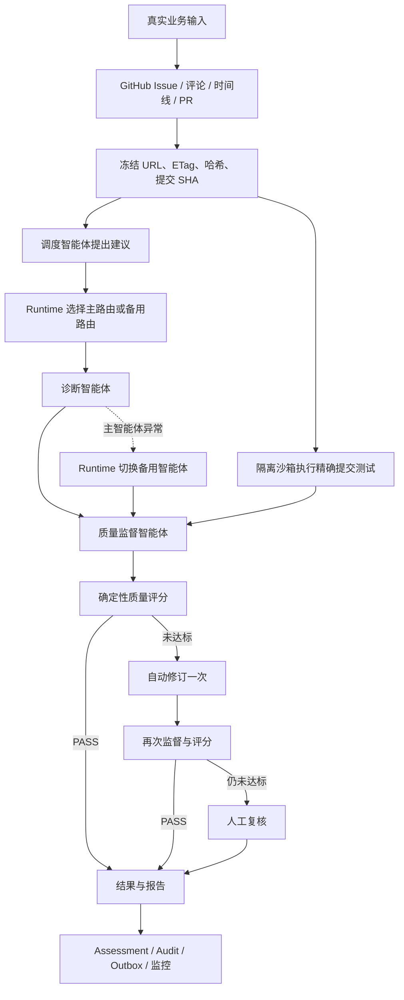

# SwarmCore 智能体调度校准业务设计

版本：1.0  
状态：VERIFIED / LOCAL  
能力包：`swarm-calibration@1.0.4`  
结果契约：`schema://swarm-calibration/result@1`

## 1. 目标与边界

本能力接收一个真实 GitHub Issue、校准目标、验收标准和可选仓库测试命令，完成：

1. 获取 Issue、评论、时间线、关联 Pull Request、变更文件和合并提交；
2. 冻结来源 URL、获取时间、ETag、响应 SHA-256 和 40 位提交 SHA；
3. 编排诊断与质量复核智能体，控制智能体间数据流；
4. 由 Runtime 决定主备路由，并在主智能体执行失败时切换备用智能体；
5. 在隔离沙箱中检出精确提交并执行测试；
6. 用确定性规则评分，失败时自动修订一次，仍不合格则进入人工复核；
7. 持久化结果、报告、证据、路由、质量评价、备用切换、审计和 Outbox 事件；
8. 在 Assessment 页面展示结果、过程和依据。

SwarmCore 只负责受控、可靠和耐久执行，不替上游理解开放目标。质量智能体只提供判断材料；
路由、重试、备用切换、分数、门禁和最终状态均由 Runtime 或确定性 Tool 决定。

## 2. 真实资料与来源

| 资料 | 真实来源 | 用途 | 冻结字段 |
|---|---|---|---|
| Issue | GitHub REST Issues API | 标题、正文、状态、标签、作者和更新时间 | URL、ETag、获取时间、响应哈希 |
| 讨论 | Issue comments 与 timeline | 约束、决策、事件和关联 PR 候选 | URL、获取时间、响应哈希 |
| 实现 | GitHub Pull Requests 与 changed files API | 合并状态、提交、变更文件和补丁摘要 | PR URL、合并 SHA、响应哈希 |
| 可执行仓库 | GitHub commit tarball | 对精确实现版本执行验收命令 | 40 位 SHA、压缩包 SHA-256 |

只接受 `https://github.com/{owner}/{repo}/issues/{number}`。GitHub 内容按不可信数据处理，提示词
注入扫描结果进入证据安全元数据；外部文本不能改写系统指令、工具权限或执行策略。

实现依据：

- [GitHub REST Issues](https://docs.github.com/en/rest/issues/issues?apiVersion=latest)
- [GitHub REST Issue Timeline](https://docs.github.com/en/rest/issues/timeline?apiVersion=2022-11-28)
- [GitHub REST Pull Requests](https://docs.github.com/en/rest/pulls/pulls?apiVersion=latest)
- [OWASP LLM Prompt Injection Prevention](https://cheatsheetseries.owasp.org/cheatsheets/LLM_Prompt_Injection_Prevention_Cheat_Sheet.html)

## 3. 模型、智能体与工具

### 3.1 模型与智能体

| 智能体 | 模型引用 | Provider 模型 | 职责 |
|---|---|---|---|
| 调度校准监督 | `model://calibration-primary@1` | `kimi-k2.5` | 解析任务与证据摘要，提出调度建议 |
| 主诊断 | `model://calibration-primary@1` | `kimi-k2.5` | 生成根因、修复方案、验收映射和证据引用 |
| 备用诊断 | `model://calibration-standby@1` | `kimi-k2.5` | 主路由不可用或执行失败时接管 |
| 质量监督 | `model://calibration-review@1` | `kimi-k2.5` | 独立检查证据覆盖、矛盾和验收满足度 |

模型只输出结构化建议，不直接执行外部副作用。Agent 使用 `node_only` 上下文，显式传递任务、
冻结证据、前次质量失败和沙箱结果，避免隐式共享上下文污染。

### 3.2 工具

能力包声明 11 个不可变 Tool：

- GitHub：Issue、讨论/时间线、Pull Request/changed files；
- 校准：证据冻结、路由选择、质量评分、尝试结果归一化、最终结果；
- 执行：仓库沙箱验证；
- 交付：报告渲染、结果持久化。

REST 专用入口为
`POST /v1/projects/{project_id}/swarm-calibration:run`；MCP Tool 为
`run_swarm_calibration`。两者均调用 `BusinessWorkService`，不建立第二套业务逻辑。

## 4. 运行策略

默认 Activity 超时 2 分钟，最多重试 3 次，指数退避 1–30 秒；全局预算为 12 分钟、
120,000 tokens、1 USD、最多 4 个 Agent、并行度 3。预算耗尽进入审批，不静默降级。
Workflow 保持确定性，GitHub、模型、数据库、文件和 Docker I/O 全部位于 Activity/Tool。

该实现遵循 Temporal 对 Workflow 确定性和 Activity 重试的约束：

- [Temporal Workflow Definition](https://docs.temporal.io/workflow-definition)
- [Temporal Retry Policies](https://docs.temporal.io/encyclopedia/retry-policies)

## 5. 质量门禁

总分 100，阈值 85：

| 维度 | 分值 |
|---|---:|
| 结果 Schema | 20 |
| 来源完整性 | 15 |
| 证据覆盖 | 25 |
| 一致性 | 15 |
| 沙箱验证 | 15 |
| 验收标准覆盖 | 10 |

以下情况形成硬失败：结构不合法、证据引用不存在、存在未解释矛盾、验收标准未覆盖、沙箱失败。
沙箱不是 `PASSED` 时总分封顶 79，因此不能自动通过。首次未达标自动修订一次；第二次仍未达标
则暂停等待人工审批。人工批准会保留原分数、失败项、批准人输入和降级状态，不篡改机器判断。

## 6. 备用切换与故障语义

调度建议不是执行授权。Runtime 根据 readiness 和策略生成最终路由：

- 主智能体就绪时优先主路由；
- 主智能体未就绪且备用就绪时直接走备用路由；
- 主智能体执行抛错时，Runtime 在同一 Agent 节点调用备用智能体；
- 主备均失败时节点失败，交由既有重试和运行状态机处理；
- 每次 Agent 输出都带 `fallback.used/primaryAgent/fallbackAgent/reason`，结果记录实际路由。

## 7. 沙箱与安全

仓库验证默认关闭并如实返回 `UNVERIFIED`。启用后要求：

- 只接受 digest 固定的专用镜像；
- 下载精确 commit tarball，最大 100 MiB，并记录压缩包 SHA-256；
- Docker 禁网、只读根文件系统、`cap-drop=ALL`、`no-new-privileges`；
- 限制 PID、内存、CPU 和总超时；
- 只读挂载归档，临时目录使用 `tmpfs`；
- 测试命令为参数数组，始终 `shell=False`；
- 验证器安全解包并拒绝多根或越界路径。

相关部署基线参考：

- [Kubernetes Application Security Checklist](https://kubernetes.io/docs/concepts/security/application-security-checklist/)
- [Kubernetes Network Policies](https://kubernetes.io/docs/concepts/services-networking/network-policies/)

## 8. 数据、日志与监控

`0018_swarm_calibration` 新增四类 tenant/project RLS 表：

- `calibration_evidence_snapshots`：不可变来源、ETag、获取时间、内容哈希和安全元数据；
- `calibration_route_decisions`：推荐路由、Runtime 实际路由和理由；
- `calibration_quality_evaluations`：分项分数、阈值、尝试序号和硬失败；
- `calibration_fallback_records`：主备引用、失败原因和切换结果。

最终 JSON/PDF、`resultHash`、报告哈希、Run/Task 事件、模型用量、Tool effect、Audit 和
`capability.swarm-calibration.assessment.completed` Outbox 事件共同构成追溯链。Web 结果页展示
路由、质量分项、沙箱、备用切换、诊断、证据链接与哈希。

## 9. 业务验收

验收用真实公开样例：

- 输入：`https://github.com/temporalio/sdk-python/issues/782`
- 获取：Issue、评论/时间线、关联 PR `#1352`、2 个 changed files；
- 冻结提交：`391338b66939c8c2068c5d28a66be682743bc972`；
- 处理：调度、诊断、质量监督、确定性评分和可选沙箱；
- 执行：GitHub Tool 与仓库验证 Tool；
- 输出：结构化结果、JSON/PDF、过程、依据和追溯哈希。

2026-07-28 本地真实模型完整链验收结果：

- Evaluation：`019fa6d5-4fc3-767e-91ef-94eb55e7b663`；
- Run：`019fa6d5-4fcf-73ad-a710-85acab5ad08d`，Temporal Run
  `019fa6d5-509d-7dce-8055-afbb3190e9dd`，状态 `SUCCEEDED`；
- 策略：`strategy://swarm-calibration/assess@4`，31 个任务、29 成功、0 失败、2 条件跳过；
- 真实数据：Issue `#782`、讨论、PR `#1352` 和 3 条冻结证据；
- 真实执行：REST、PostgreSQL、Temporal、GitHub REST、Agno、外部 Kimi、Model/Agent/Tool Gateway
  和 digest 固定 Docker 沙箱；
- 模型：`kimi-k2.5` 共 7 次成功调用，覆盖调度、主诊断、备用诊断、质量监督和一次修订；
  持久化 82,172 input tokens、17,695 output tokens；
- 沙箱：固定提交编译通过，归档哈希
  `16f771f5784b9ecd46592133e14fd90c51f861f8abafb52c4234ea6a6cab187e`；
- 质量：`100 / 100`、`PASS`，最终状态 `COMPLETED`，结果哈希
  `57ecb6ea157a6565aedf9244ab936f2a9bc2b208f8c71403bb65534a6f58f346`；
- 追溯：180 条运行事件、12 条成功 Tool effect、14 条 Audit、2 次人工批准，
  185 条 Outbox 全部 `DELIVERED`，JSON/PDF 各 1 份；
- RLS：4 张校准表均启用并强制 tenant/project RLS；本次写入 3 条证据、1 条路由和
  1 条质量记录；恢复后最终采用主路由，因此校准备用切换记录为 0，备用 Agent 仍完成了
  1 次真实模型调用并验证可用性。

证据文件：
`output/swarm-calibration-real-model/real-chain-20260728T042321Z-kimi.json`。
验收过程中还通过原生 `retry_task` 恢复了 Tool/Model 能力签名配置不一致造成的节点失败，
验证了失败等待、配置修正、命令投递和同一 Workflow 恢复执行。该结论只覆盖本地真实系统链；
Playwright 和生产部署资格仍未验收。
